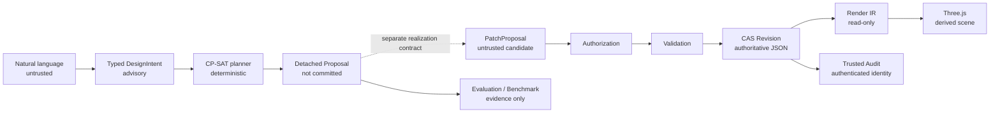

# AI Parametric Architect Studio

> A safe, constraint-aware world-model planning environment for architectural AI.

AI Parametric Architect Studio converts natural-language requirements into a typed `DesignIntent`,
uses a deterministic constraint solver to produce an evaluable detached Proposal, and presents
validated World Models through a read-only Three.js scene. A persisted JSON Revision is always the
only authoritative model. LLM output, solver output, benchmark reports, Render IR, and frontend
scene state never have commit authority.




## Understand the Product in 30 Seconds

- **Design Studio** replays three offline scenarios and exposes only observable outputs: typed DesignIntent, solver strategy, constraint count, runtime, explicit N/A states, and stable failure codes. It never displays hidden reasoning.
- **Detached Planning Sandbox** provides an interactive preview of `FloorPlanProposal v2`, always labeled “Detached Proposal,” “Not committed,” and “Advisory.”
- **Benchmark Lab** compares `rule-spatial-v2` and `cp-sat-v2`, separates end-to-end and oracle-intent tracks, retains failed attempts in denominators, and reports metric coverage and N/A states.
- **World Model Explorer** displays validated rooms, walls, doors, windows, floors, and revision identity through the one-way `World Model → Render IR → Three.js` path.
- **Architecture & Safety** explains why an LLM cannot directly edit geometry, why evaluation is not authorization, and how CAS rejects stale writes.

## One-Command Offline Showcase

Requirements:

- Python 3.12–3.13
- `uv`
- Node.js `>=22.13.0`
- npm

macOS, Linux, and WSL2 are recommended. Native Windows has not been verified.

```bash
git clone --branch final-showcase https://github.com/Owenqi666/AI_Parametric_Architect.git
cd AI_Parametric_Architect

python3 --version
uv --version
node --version
npm --version

make showcase
```

The first run verifies and installs locked dependencies. Wait until the terminal shows Vite's
`Local` URL and Uvicorn reports `Application startup complete`, then open
`http://127.0.0.1:3000`. FastAPI runs at `http://127.0.0.1:8000`. Pressing `Ctrl+C`
terminates both child processes cleanly.

Override the ports if either default is unavailable:

```bash
SHOWCASE_BACKEND_PORT=8010 SHOWCASE_FRONTEND_PORT=3010 make showcase
```

Once locked dependencies are installed or cached, the default showcase requires no API key,
network connection, database, or manual fixture preparation. A first-time cold install may still
require access to package registries.

See the [Chinese User Guide](docs/USER_GUIDE.zh-CN.md) and
[Showcase Guide](docs/SHOWCASE.md). The portfolio documentation also includes the
[Case Study](docs/CASE_STUDY.md), [Architecture Overview](docs/ARCHITECTURE_OVERVIEW.md),
[Benchmark Methodology](docs/BENCHMARK_METHODOLOGY.md), and
[Demo Recording Script](docs/DEMO_SCRIPT.md).

| Design Studio | Benchmark Lab |
| --- | --- |
|  |  |

| World Model Explorer | Architecture & Safety |
| --- | --- |
|  |  |

## Five-Minute Product Tour

1. In **Design Studio**, keep the `South-facing family house` scenario selected and click **Run planning**. Inspect the typed DesignIntent, select the Kitchen, and verify the adjacency constraint and all three detached-status warnings.
2. Switch to `Compact apartment` and compare the baseline with CP-SAT across spatial efficiency, circulation proxy, runtime, and stability evidence.
3. Run `Conflicting spatial constraints`. Confirm that the system reports `PLANNING_SOLVER_FAILED` without producing a Proposal or fabricating metrics.
4. Open **Benchmark Lab** and switch between End-to-end and Oracle intent. Use **Import report** to load a local report admitted through the strict `BenchmarkReport 1.0.0` contract.
5. Open **World Model**, search for or select an entity, toggle floor visibility, and try Fit, Top, and Isometric views. Finish in **Architecture & Safety** to review the Proposal, Authorization, CAS, and Render IR authority boundaries.

If you edit the requirement into text that is not part of the recorded offline fixtures, the system
fails closed with `SHOWCASE_INPUT_NOT_RECORDED`. This is intentional: offline mode neither silently
calls the network nor fabricates solver output.

## Technical Highlights and Honest Boundaries

- JSON Schema Draft 2020-12, semantic and reference rules, and Shapely geometry checks jointly define World Model admission.
- JSON Patch, full-model validation, revision CAS, Undo/Redo, and trusted audit form the only authoritative write path.
- OR-Tools CP-SAT returns only a detached `FloorPlanProposal v2`. Proposal preview uses a separate frontend contract and never enters `WorldModelRenderIRProjector`.
- The OpenAI Responses adapter is explicitly opt-in and can return only `DesignIntent`. This release does not expose live OpenAI controls in Design Studio.
- Versioned BenchmarkReport imports undergo exact-field, finite-number, resource-budget, and deep-freeze validation. Scores are evidence, never commit authorization.
- This is a production-oriented research prototype. It does **not** claim building-code compliance, automatic architectural correctness, authoritative AI-generated geometry, or readiness for direct public deployment.
- Repository and audit storage are currently in-process implementations. The circulation metric is a center-distance proxy, not a complete circulation analysis.

Current positioning: **Production-oriented AI Agent Framework Prototype with constraint-aware
detached planning, evaluation, and read-only 3D visualization**.

The project includes security hardening, Phase 7 Tasks 7.1–7.2, Final Enhancement Priorities 1–3,
and an offline portfolio showcase. It is not yet a production-ready public service.

The core World Model pipeline is complete:

```text
authoritative JSON World Model
  -> JSON Schema Draft 2020-12
  -> semantic/reference validation
  -> Shapely geometry validation
       -> deterministic SVG
       -> immutable Render IR 1.0.0
            -> strict browser-side contract parser
            -> read-only Three.js scene
  -> CLI / FastAPI / viewer
```

The deterministic editing path does not depend on an LLM:

```text
immutable revision snapshot
  -> apply add/remove/replace JSON Patch to a copy
  -> JSON-only value guard
  -> schema + semantic + Shapely validation
  -> compare-and-swap commit
  -> append-only audit log
```

The Agent Evolution Roadmap proposal pipeline and evaluation infrastructure are also complete:

```text
Natural Language
  -> RequirementAgent
  -> immutable DesignIntent
  -> ArchitecturePlannerAgent
  -> typed PlanningRules + SpatialConstraint
  -> deterministic OR-Tools CP-SAT solver
  -> detached spatial FloorPlanProposal v2
  -> PatchGeneratorAgent
  -> semantic-only PatchProposal + affected entity IDs
  -> validation + revision commit

Typed LLMProvider
  -> deterministic Mock for all three typed output contracts
  -> opt-in OpenAI Responses adapter for DesignIntent only
  -> Requirement / FloorPlan / Patch proposal adapters
  -> EvaluationRunner + detached full validation
  -> tenant-scoped HMAC AgentTrace correlation (no chain-of-thought)

Validation error
  -> ConstraintReasoningAgent
  -> symbolic ConstraintResolutionPlan
  -> human/later planning decision (no automatic patch)

versioned requirements dataset + separate reference annotations
  -> read-only two-track BenchmarkRunner
  -> allowlisted, redacted BenchmarkReport
```

`DesignIntent` is a candidate intermediate representation that exists before the World Model. It
contains no coordinates and is not a second persisted world state. Agents and planners may derive a
`Plan` or `PatchProposal` from it, but a change becomes authoritative JSON state only after Patch
processing, full-model validation, and a successful revision commit.

The CP-SAT `FloorPlanProposal v2` remains detached. It is not an input to Render IR and is never
presented by Three.js as committed geometry. Geometry can reach Render IR only after an authorized
Patch passes full validation and revision CAS into the authoritative JSON World Model.

This release includes a real OpenAI Responses API adapter, but default composition, standard CLI
commands, FastAPI, and the benchmark CLI do not enable it automatically. The real adapter performs
only requirement-to-`DesignIntent` parsing. It cannot generate FloorPlans or Patches and cannot read
the World Model. `MockLLMProvider` continues to provide deterministic coverage for all three typed
output contracts.

The current scope does not include Multi-Agent coordination, automatic correction, DXF, IFC, or
building-code RAG.

Security hardening places every input behind a strict JSON trust boundary, applies compute budgets
to models and Patches, uses defensive snapshots to prevent Revision initialization TOCTOU, and
separates Agent submission authority, trusted audit identity, and tenant-scoped HMAC trace
correlation. See [Security.md](Security.md).

## Environment and Installation

The project requires `uv`. The default development environment uses Python 3.13, while the package
supports Python 3.12–3.13 and CI verifies both versions. Runtime and development dependencies are
locked through `uv.lock`.

CP-SAT is pinned to `ortools==9.15.6755`, with support for the CPython macOS and Linux wheels used by
project CI. Alpine/musl and PyPy are not currently supported.

```bash
uv sync --dev --locked
```

The Three.js viewer requires Node.js `>=22.13.0`. CI uses Node 24, and frontend dependencies are
locked through `frontend/package-lock.json`.

## Run the Backend

Start FastAPI:

```bash
uv run uvicorn ai_parametric_architect.backend.api:app --reload
```

Available endpoints:

- `GET /health`
- `GET /v1/capabilities` — returns only safe capability booleans
- `POST /v1/models/validate`
- `POST /v1/models/render/svg`
- `POST /v1/models/render/ir`
- `POST /v1/models/render/ir?floor_id=<floor-id>`

A successful Render IR response uses `application/json`. Invalid models, unknown floors, and models
without visible geometry return structured `422` reports with stable issue codes.

Validate a valid model:

```bash
curl -sS -X POST http://127.0.0.1:8000/v1/models/validate \
  -H 'Content-Type: application/json' \
  --data-binary @examples/valid_simple_house.json
```

Validate the overlapping-room fixture, which returns `ROOM_OVERLAP`:

```bash
curl -sS -X POST http://127.0.0.1:8000/v1/models/validate \
  -H 'Content-Type: application/json' \
  --data-binary @examples/invalid_overlap.json
```

Render SVG:

```bash
curl -sS -X POST http://127.0.0.1:8000/v1/models/render/svg \
  -H 'Content-Type: application/json' \
  --data-binary @examples/valid_simple_house.json \
  --output simple_house.svg
```

Generate versioned Render IR:

```bash
curl -sS -X POST http://127.0.0.1:8000/v1/models/render/ir \
  -H 'Content-Type: application/json' \
  --data-binary @examples/valid_simple_house.json \
  --output simple-house.render-ir.json
```

The CLI exposes the same deterministic pipeline:

```bash
uv run ai-architect validate examples/valid_simple_house.json
uv run ai-architect render-svg examples/valid_simple_house.json simple_house.svg
```

## Three.js World Model Visualization — Final Enhancement Priority 1

`RenderIR 1.0.0` is an immutable, versioned, deterministic visualization contract projected from a
World Model that has passed full validation. It preserves the source model's `schema_version`,
`model_id`, `revision`, and `root_building_id`, along with its native right-handed, Z-up,
meter-and-degree coordinate conventions. Three.js runtime coordinates never become a new source of
geometry authority.

The current projector and viewer support:

- room polygon surfaces, vertical wall extrusion, and door/window opening panels;
- backend projection by floor and frontend floor-visibility controls;
- isometric and top cameras, orbit and zoom controls, entity selection, and read-only property inspection;
- stable mapping from `entity_id` to scene objects.

The viewer accepts only Render IR. It does not read or modify the source World Model, generate
Patches, access the repository, or possess authorization or revision-commit capabilities.

Version 1 does not display stairs. Doors and windows are represented as panels and do not modify wall
geometry through CSG. The default showcase loads the same-source static fixture at
`frontend/public/examples/showcase-house.render-ir.json`. Python integration tests verify it against
backend projector output. The default page does not submit a World Model to the POST API.

Start the viewer:

```bash
cd frontend
npm ci
npm run dev
```

## Real LLM Adapter — Final Enhancement Priority 2

`OpenAIResponsesProvider` lives in `infrastructure/llm` and uses Responses API strict JSON Schema
while still returning an exact immutable `DesignIntent` through the provider-neutral `LLMProvider`
interface.

The provider does not expose live-network FloorPlan or Patch generation. Requests for either
`LLMOutputKind` fail closed before any network call. Successful responses must also pass, in order:

1. strict JSON decoding that rejects duplicate keys, non-finite numbers, and trailing text;
2. response byte-budget enforcement;
3. `IntentValidator`;
4. `DesignIntent.from_dict()`.

Provider structured-output guarantees are not treated as a trust boundary.

The real parser must be created explicitly. Existing `create_requirement_agent()` composition and
all default services remain offline:

```python
import os

from ai_parametric_architect.composition import (
    create_architecture_planner_agent,
    create_openai_requirement_agent,
)
from ai_parametric_architect.infrastructure import OpenAIProviderConfig

requirement_agent = create_openai_requirement_agent(
    OpenAIProviderConfig(model=os.environ["OPENAI_MODEL"])
)
intent = requirement_agent.run("Create a 120 sqm three bedroom house")
proposal = create_architecture_planner_agent().run(intent)
```

The OpenAI SDK reads credentials from `OPENAI_API_KEY`. The key is never part of provider
configuration, prompts, errors, or traces. The model must be supplied explicitly through trusted
deployment configuration; production deployments should pin a validated snapshot that supports
Structured Outputs.

Requests disable tools and set `store=False`, `truncation="disabled"`, and bounded timeout, token,
and byte budgets. SDK retries default to 0 and may be explicitly configured up to 2 in a trusted
deployment.

The resulting CP-SAT `proposal` remains a detached v2 recommendation. It cannot enter Render IR and
cannot create committed geometry.

## Planning Benchmark Framework (Final Enhancement Priority 3)

`ai_parametric_architect.benchmark` is a read-only, authority-neutral benchmark package. Its public API exposes immutable data and report contracts plus a detached runner with only a `run()` capability. Importing the package does not load OR-Tools. Parsers, planners, and the monotonic clock are injected at the composition boundary; the core runner has no provider, repository, Patch, validation, revision, authorization, or commit capability.

Benchmark input is strictly separated into two independent `1.0.0` artifacts:

- The dataset contains only sorted case IDs, tags, and untrusted natural-language requirements.
- The annotation set contains externally supplied reference intents and constraints. It is bound to the dataset ID and version and must cover its cases exactly one-to-one.

Both contracts enforce exact fields, canonical JSON values, immutable data, and independent versioning. Each artifact receives a canonical SHA-256 digest derived from normalized content. Loaders limit each file to 1 MiB, each dataset to 64 cases, and each requirement to 16 KiB. Before calling the clock or an Agent, the runner also validates the complete `cases × systems × trials` budget. The CLI budget is fixed at 16 cases, 3 systems, 4 trials, and 192 attempts; it is recorded with the metric context in every report to support meaningful comparisons.

Run the default offline benchmark with the repository fixtures:

```bash
uv run ai-architect-benchmark \
  benchmarks/datasets/planning-core-1.0.0.json \
  benchmarks/annotations/planning-core-reference-1.0.0.json \
  planning-benchmark-report.json \
  --trials 2
```

The built-in composition provides three comparable systems. The runner can also accept injected systems that satisfy its narrow ports:

- `rule-spatial-v2`: deterministic rule parser plus an independent single-row spatial baseline.
- `cp-sat-v2`: the same deterministic rule parser plus the CP-SAT v2 planner.
- `openai-cp-sat-v2`: the real OpenAI intent parser plus the same CP-SAT planner, available only through explicit opt-in.

`RuleBasedSpatialFloorPlanPlanner` has no OR-Tools dependency. It creates a `FloorPlanProposal v2` from the stable intent order and equal-area targets. It does not replace or modify the existing semantic-only `RuleBasedFloorPlanPlanner` v1 / `equal-area-stable-order-v1` path. Each system descriptor records Agent and system versions, planner strategy, rules version, seed, and execution mode. Live systems additionally record the provider, model, and prompt version.

Every system, case, and trial runs on two tracks:

- `end_to_end` sends the dataset requirement to the parser, then sends the parsed intent to the planner.
- `oracle_intent` bypasses the parser completely and sends the annotation's reference intent only to the same planner, isolating planning quality from parsing quality.

Reference intents and constraints never enter the end-to-end parser. The standard fixture deliberately places positional relationship descriptions after explicit room lists. This prevents room-list syntax from becoming a confounding factor while exposing the known limitation that the current deterministic parser does not extract spatial constraints. The oracle track compares both planners against the same reference intents.

Reports aggregate exact intent accuracy, planning success, plan validity, constraint satisfaction, spatial efficiency, circulation proxy, repeated-run stability, and parse/plan/total runtime statistics: min, median, p95, max, and total. Binary metrics use every attempt as the denominator. Each metric and runtime also includes `attempt_count`, `covered_attempt_count`, `sample_count`, and coverage, so failed or non-applicable samples cannot disappear silently. End-to-end spatial scores cover only successful proposals whose parsed intents exactly match their references. Stability samples are pairs of repeated runs for the same case. Built-in proposal outputs are reproducible, but complete reports are not guaranteed to be byte-for-byte identical because the production clock records actual runtime.

`BenchmarkReport` serializes only allowlisted identity, artifact versions and digests, budget and context, system descriptors, counts and scores, proposal digests, nanosecond timings, and sanitized failure `stage/code/path` values. It does not retain raw requirements, reference answers, typed intents or plans, provider output or messages, prompts, exception messages or details, or credential fields. Allowlisted descriptor, ID, model, and context metadata is still supplied by trusted callers, may be sensitive, and must never contain secrets.

Datasets, annotations, `FloorPlanProposal` objects, and reports are detached evidence only. They are not a World Model, revision, authorization artifact, or commit input. Priority 3 does not change validation, revision, authorization, or commit boundaries.

The third system is included only when the caller explicitly supplies `--openai-model <approved-model-snapshot>`. Credentials continue to be read by the OpenAI SDK from `OPENAI_API_KEY` or an equivalent managed secret channel. This project does not claim that a live OpenAI network benchmark was executed. Automated acceptance tests use a substitute client to verify opt-in behavior, request boundaries, and sanitization.

## Revisions and JSON Patch

`ModelRevision` is an immutable envelope around the authoritative JSON snapshot. It contains `model_id`, `revision_number`, a timezone-aware `created_at`, and `parent_revision`. Its `revision_number` always matches the snapshot's `revision`; geometry and entity data remain exclusively in JSON.

The Patch engine implements an explicit RFC 6902 subset: `add`, `remove`, and `replace`. It does not claim support for `copy`, `move`, or `test`. The engine strictly parses RFC 6901 JSON Pointers and applies each complete Patch atomically to a deep copy. Root removal is rejected. The application layer additionally protects the root path, `model_id`, `revision`, `schema_version`, and `geometry_settings`. Only the commit workflow may increment the revision, and candidate geometry cannot relax its own precision-admission policy within the same Patch. Every state admitted to history must also be a depth-bounded standard JSON tree with no cycles or shared container references.

Python application-service example:

```python
import json
from pathlib import Path

from ai_parametric_architect.composition import create_editing_service
from ai_parametric_architect.domain import (
    AuditActorType,
    PatchOperation,
    PatchProposal,
    TrustedAuditIdentity,
)

model = json.loads(Path("examples/valid_simple_house.json").read_text(encoding="utf-8"))
editing = create_editing_service()
identity = TrustedAuditIdentity(
    actor_id="architect-7",
    actor_type=AuditActorType.HUMAN,
    trace_id="request-018f6d91",
)
editing.initialize(
    model,
    provenance="import:file",
    rationale="Create revision history.",
    audit_identity=identity,
)

revision = editing.apply_patch(
    "mdl_simple_house",
    PatchProposal(
        base_model_id="mdl_simple_house",
        base_revision=0,
        operations=(
            PatchOperation(
                "replace",
                "/metadata/description",
                "Updated through JSON Patch.",
            ),
        ),
        provenance="ui:manual-edit",
        rationale="Update the model description.",
    ),
    audit_identity=identity,
)

undone = editing.undo(
    revision.model_id,
    expected_revision=revision.revision_number,
    provenance="ui:manual-edit",
    rationale="Undo the description edit.",
    audit_identity=identity,
)
```

`undo` and `redo` never move or overwrite an earlier snapshot. They commit new compensating revisions, keeping revision numbers strictly monotonic. A restoration candidate is revalidated against the current Schema and geometry rules before its CAS commit. A successful ordinary Patch clears the redo branch. Rejected Patches, conflicts, and validation failures do not change the snapshot, history stacks, or audit log.

The default `InMemoryRevisionRepository` is intended only for single-process execution and development tests. Data does not survive process restarts and is not shared across processes. The `RevisionRepository` port remains available for a future persistence adapter. Such an adapter must atomically update the snapshot, head, undo/redo stacks, and audit entry using CAS semantics. This phase does not add a Patch HTTP endpoint.

Every write operation requires a `TrustedAuditIdentity` supplied independently by the authenticated application context. Proposal provenance and rationale are untrusted descriptions and cannot assert a human identity. Audit serialization marks them explicitly as `untrusted_provenance` and `untrusted_rationale`.

## Production-Oriented Hardening

`StrictJsonTreeGuard` is the shared JSON trust boundary for the API, Validator, EditingService, and Evaluation layers. It accepts only standard JSON trees without cycles or container aliases and rejects `NaN`/`Infinity`, datetime values, sets, tuples, custom objects, and non-string keys. Consequently, an unchanged model accepted by the Validator is also safe to store in a Revision snapshot.

`ModelComplexityPolicy` centralizes limits for total entities, polygon vertices, coordinate magnitude, room area, wall length, and Patch operation count. The defaults are safety limits for this prototype, not building-code thresholds, and can be tightened through dependency injection. Stable issue codes are returned before expensive Shapely work when a limit is exceeded. The HTTP adapter also applies a default 2 MiB request-body limit and returns `413` / `REQUEST_BODY_TOO_LARGE` when exceeded.

Agent-generated Proposals never receive direct commit authority. `AgentAuthorizationGateway` first applies deterministic policy checks for intent alignment, model and revision binding, allowed operations, paths, entities, and affected entities. Only then may validation and CAS commit run. Evaluation results are not an accepted gateway input type and therefore cannot serve as authorization evidence.

## Design Intent Layer (Roadmap Task 1)

`ai_parametric_architect.intent` defines provider- and LLM-neutral Task 1 contracts:

- `DesignIntent`: building type, target area, room requirements, optional orientation, and spatial constraints.
- `RoomRequirement`: a compact `{room_type, count}` representation.
- `SpatialConstraint`: an adjacency, proximity, separation, or relative-direction relationship between two requested room types.
- `IntentValidator`: validates standard JSON and the Draft 2020-12 Schema before applying semantic constraints that JSON Schema cannot express completely. It never normalizes or modifies its input.

Canonical output continues to use an expanded `rooms` array for compatibility with the existing PlanningRecord:

```json
{
  "building_type": "house",
  "area": 120,
  "rooms": ["living", "bedroom", "bedroom", "kitchen"],
  "orientation": "south",
  "spatial_constraints": [
    {
      "source_room_type": "kitchen",
      "relation": "adjacent_to",
      "target_room_type": "living",
      "required": true
    }
  ]
}
```

An equivalent compact `room_requirements` input is also accepted. The two representations are mutually exclusive and normalize to the same immutable `DesignIntent`. Spatial relationships may reference only distinct room types already requested by the intent. Version 1 supports `adjacent_to`, `near`, `separated_from`, and the four relative-direction relationships.

```python
from ai_parametric_architect.intent import (
    DesignIntent,
    IntentValidator,
    RoomRequirement,
    SpatialConstraint,
)

intent = DesignIntent(
    building_type="house",
    area=120,
    room_requirements=(
        RoomRequirement("living"),
        RoomRequirement("bedroom", 3),
        RoomRequirement("kitchen"),
    ),
    orientation="south",
    spatial_constraints=(
        SpatialConstraint(
            source_room_type="kitchen",
            relation="adjacent_to",
            target_room_type="living",
        ),
    ),
)

assert IntentValidator().validate(intent.to_compact_dict()) == ()
```

The versioned Schema resource is stored at `ai_parametric_architect/intent/schemas/design-intent-1.0.0.schema.json`. It is packaged with the World Model Schema and verified after installation from an isolated wheel.

## Requirement Agent (Roadmap Task 2)

Task 2 is implemented through a provider-neutral generic `Agent[Input, Output]` protocol and an immutable `RequirementAgent`. The agent receives only raw natural language and returns a domain-validated `DesignIntent`. It does not receive a model document, revision repository, or editing service, and it retains no session state. The default production composition injects the deterministic `RuleBasedRequirementParser`; no live LLM is used in this default path.

```python
from ai_parametric_architect.composition import create_requirement_agent

agent = create_requirement_agent()
intent = agent.run("Create a 120 sqm three bedroom house")

assert intent.to_dict() == {
    "building_type": "house",
    "area": 120,
    "rooms": ["bedroom", "bedroom", "bedroom"],
    "orientation": None,
}
```

The current rule grammar deterministically parses only explicitly supported English and Chinese building types, square-metre units, room types and counts, and four cardinal orientations. Conflicts, ambiguity, unsupported area expressions, and unsupported qualifying relationships are rejected with structured errors instead of being guessed. `RequirementAgent.parse()` adapts the existing `RequirementParser` port, so the complete planning pipeline passes through the Agent boundary.

## Architecture Planner Agent (Roadmap Task 3)

Task 3 introduces `FloorPlanProposal`, an independent immutable Plan IR between `DesignIntent` and World Model Patches. Phase 7 Task 7.1 upgrades the production composition from the simple equal-area rule to an integer-grid OR-Tools CP-SAT solver. `ArchitecturePlannerAgent` still receives only an intent—not a model document, revision, or repository—and gains no additional authority.

```python
from ai_parametric_architect.composition import (
    create_architecture_planner_agent,
    create_requirement_agent,
)

intent = create_requirement_agent().run("Create a 120 sqm three bedroom house")
plan = create_architecture_planner_agent().run(intent)

assert [room.plan_id for room in plan.rooms] == [
    "plan_room_001",
    "plan_room_002",
    "plan_room_003",
]
assert plan.schema_version == "2.0.0"
assert plan.strategy == "cp-sat-rectilinear-v1"
assert plan.boundary is not None
assert all(room.is_placed for room in plan.rooms)
```

The Proposal contract is strictly versioned:

- Version 1, `1.0.0`, retains the original semantic-only three-field room JSON for compatibility tests and the explicit legacy adapter. Optional coordinates are never added implicitly.
- Version 2, `2.0.0`, requires complete `x/y/width/height/orientation` values for every room plus a proposal-local rectangular boundary. Missing fields, non-finite values, out-of-bounds placement, overlaps, and inconsistent orientation exposure are rejected.

`cp-sat-rectilinear-v1` uses one `PlanningGridPolicy` and injectable `PlanningRules`:

- **Decision variables:** integer-grid `x/y/width/height` values and boundary orientation for every room.
- **Hard constraints:** minimum room area, boundary containment, `NoOverlap2D`, positive shared-edge adjacency, clearance-based separation, `near`, and the four relative directions.
- **Soft objectives:** space utilization, target-area deviation, bounding-box compactness, a room-center Manhattan-distance circulation proxy, orientation preference, and optional spatial constraints.
- **Determinism:** stable IDs and model order, same-type room symmetry constraints, one worker, a fixed seed, deterministic-time budget, bounded integer objectives, and a stable tie-break. Only `OPTIMAL` results are accepted; `FEASIBLE`, `UNKNOWN`, and `INFEASIBLE` never fall back to legacy rules.

The original `equal-area-stable-order-v1` planner remains available explicitly for compatibility, but it is no longer the production composition default. Type-level spatial constraints remain bound deterministically to the first planned room of that type because `DesignIntent` v1 does not yet provide instance selectors.

Solved coordinates belong to a detached Proposal, not authoritative geometry. The current patch rule maps only plan semantics into room slots that already exist in the Revision. It creates `name` and `usage` operations plus an owned planning record in a `PatchProposal`. It never creates a `/geometry` operation, and the authorization allowlist has not been widened. Existing World Model geometry therefore remains byte-for-byte unchanged after commit. Area, orientation, and spatial constraints remain recorded as `unverified_constraints` until a future realization workflow receives separate authorization and passes complete geometry validation.

The solver scope is intentionally conservative: proposal-local, axis-aligned rectangles only. Boundaries come either from explicit fixed dimensions in the rules or from a versioned utilization/aspect derivation policy. Circulation is only a room-center distance proxy—not door, corridor, reachability-graph, or evacuation analysis. Default minimum areas are planning-policy values, not building-code conclusions.

Phase 7 Tasks 7.1–7.2 are complete. Final Enhancement Priorities 2–3 complete Tasks 7.4–7.5 through the DesignIntent-only OpenAI adapter and detached planning benchmark. Task 7.3, the knowledge layer, and Task 7.6, the proposal evaluation loop, remain future work.

## Constraint Reasoning Agent (Roadmap Task 4)

Task 4 converts one error-level `ValidationIssue` into a non-executable candidate-resolution plan. It does not attempt automatic correction. `ConstraintReasoningAgent` never reads the model document or repository; it preserves issue identity and returns a versioned, machine-readable `ConstraintResolutionPlan`.

```python
import json
from pathlib import Path

from ai_parametric_architect.composition import (
    create_constraint_reasoning_agent,
    create_service,
)

model = json.loads(Path("examples/invalid_overlap.json").read_text(encoding="utf-8"))
report = create_service().validate(model)
issue = next(issue for issue in report.issues if issue.code == "ROOM_OVERLAP")
plan = create_constraint_reasoning_agent().run(issue)

assert [candidate.action.value for candidate in plan.candidates] == [
    "resize_room",
    "change_layout",
]
```

The current conservative rule set offers alternatives only for issues that can be located safely:

- `ROOM_OVERLAP` → `resize_room` / `change_layout`
- `WALL_ZERO_LENGTH` → `move_wall` / `change_layout`

A recognized code must also match the validator-produced RFC 6901 registry path and expected entity count. Unknown issues, non-error issues, and issues without safely identifiable entities produce `manual_review_required` or a structured rejection.

`CandidateSolution` contains only an action, affected entity IDs, and a rationale. It contains no coordinates, model, revision, or Patch operations. It is a decision-support plan that a later Patch Generator must explicitly convert into a `PatchProposal`, followed by full validation and revision commit. That automatic end-to-end loop is not implemented. Because a reasoning plan is not bound to a model revision, it cannot authorize an executable Patch or provide stale-write protection.

## Patch Generator Agent (Roadmap Task 5)

Task 5 separates Plan-to-Patch conversion from planning through an explicit Agent boundary. `PatchGenerationRequest` pairs a `FloorPlanProposal` with its current immutable `ModelRevision`, avoiding implicit or stale context:

```python
from ai_parametric_architect.agents import PatchGenerationRequest
from ai_parametric_architect.composition import (
    create_architecture_planner_agent,
    create_patch_generator_agent,
    create_requirement_agent,
)

intent = create_requirement_agent().run("Create a 120 sqm three-bedroom house")
plan = create_architecture_planner_agent().run(intent)
proposal = create_patch_generator_agent().run(
    PatchGenerationRequest(plan=plan, current_revision=current_revision)
)
```

The Patch Agent cannot call the patch engine, validator, repository, or commit boundary. It rejects:

- a `base_model_id` that does not match the request model;
- a `base_revision` that does not match the request revision;
- proposals without `affected_entity_ids`;
- proposals that reference entities absent from the current revision;
- requests or generator outputs that violate the port contracts.

When the current model already satisfies the intent, the Agent returns `None` as an explicit no-change result instead of producing an empty Patch.

The deterministic generator is currently restricted to room `name`/`usage` changes and its owned planning trace. Application code does not trust proposal metadata: it independently derives affected entity IDs from the validated before/after JSON difference, requires an exact match, and writes only that verified set to audit details.

Both `base_model_id` and `base_revision` bind the proposal to its source snapshot, preventing cross-model replay even when revision numbers match. For an explicit no-change result, the commit use case rereads the repository head before returning. If the revision advanced during planning, it returns `REVISION_CONFLICT` instead of reporting a stale snapshot as current.

Agent output remains a detached proposal. Only `ArchitecturePlanningService.plan_and_commit()` or `EditingService.apply_patch()` may execute copy → Schema/semantic/Shapely validation → CAS commit. Validation is therefore enforced at the commit boundary, not asserted by the Agent. Task 4 `ConstraintResolutionPlan` values are not revision-bound and are not accepted as executable Task 5 inputs.

## LLM Adapter Layer (Task 6.1)

`ai_parametric_architect.llm` is a typed adapter boundary with no vendor SDK dependency. `LLMProvider.complete()` may return only these exact, immutable value types:

- `DesignIntent`
- `FloorPlanProposal`
- `PatchProposal`

`StructuredPrompt` binds a prompt to its expected output type. Runtime checks reject arbitrary mappings, incorrect types, and subclasses of allowed types. Three narrow adapters implement the existing `RequirementParser`, `FloorPlanPlanner`, and `PatchProposalGenerator` port shapes, allowing injection into existing Agents without exposing repository, Patch application, or commit methods:

```python
from ai_parametric_architect.agents import RequirementAgent
from ai_parametric_architect.domain import DesignIntent
from ai_parametric_architect.llm import LLMRequirementParser, MockLLMProvider

expected = DesignIntent(building_type="house", area=120, rooms=("bedroom",) * 3)
provider = MockLLMProvider((expected,))
agent = RequirementAgent(LLMRequirementParser(provider))

assert agent.run("Design a 120 sqm three-bedroom house") is expected
```

A FloorPlan prompt receives only a validated intent. A Patch prompt receives an explicit defensive snapshot of the detached `ModelRevision`, but projects only `base_model_id`, `base_revision`, the owned planning record, and the minimum semantic fields for existing room slots. Coordinates, metadata, and arbitrary extension content are excluded.

The opt-in OpenAI provider receives only the natural-language requirement and may return only a locally revalidated `DesignIntent`. It has no access to revisions, the World Model, repository, authorization, Patch, or commit dependencies. Provider rejection, incomplete responses, network failures, and invalid JSON map to stable, sanitized, provider-neutral error codes.

`MockLLMProvider` can test FloorPlan and Patch contracts explicitly. Real network capability is intentionally limited to DesignIntent extraction.

## Agent Evaluation Framework (Task 6.2)

`Scenario` is a strict, immutable three-field contract:

```json
{
  "input_requirement": "Create a 60 sqm one-bedroom house",
  "expected_intent": {
    "building_type": "house",
    "area": 60,
    "rooms": ["bedroom"],
    "orientation": null
  },
  "expected_constraints": []
}
```

`EvaluationRunner` evaluates intent, plan, and Patch through narrow ports and reports:

- `intent_extraction_accuracy`: scenario-level exact-match rate against the expected intent.
- `plan_validity`: rate at which plans preserve the intent, rooms, and spatial constraints.
- `patch_validation_success_rate`: rate at which detached Patches pass copy-based Schema/semantic/Shapely validation and affected-entity difference verification.

`DetachedPatchValidator` depends only on `PatchEngine` and `Validator` ports. It never accesses the repository or commits a revision. Reports retain observable typed outputs, issue codes, and structured stage failures. Unexpected dependency defects propagate instead of being hidden by broad exception handling.

### Planning Evaluation Upgrade (Phase 7 Task 7.2)

`PlanningMetricsEvaluator` is a pure evaluation boundary that runs alongside the original `EvaluationRunner`. It accepts previously generated `FloorPlanProposal` sequences, never reruns Agents or LLMs, never applies Patches, and never reads or writes a repository.

Every batch must preserve the exact same `DesignIntent` and use an explicit immutable `PlanningMetricContext`, including comparable rule IDs, minimum-area, adjacency, separation and proximity thresholds, `GeometryPrecisionPolicy`, and maximum run count.

Report schema v1 defines four `[0, 1]` metrics:

- `constraint_satisfaction_score`: evaluates room minimum areas, boundary containment, pairwise non-overlap, and every declared spatial relationship, including optional preferences.
- `spatial_efficiency_score`: total net room area divided by Proposal boundary area.
- `circulation_score`: an explicit proxy based on pairwise Manhattan distance between room centers. It is not door or corridor path analysis, accessibility validation, or evacuation validation.
- `plan_stability_score`: symmetrically compares boundary, normalized room placement, orientation, IDs, and constraint bindings across all runs for the same intent. Identical plans score `1.0`.

A semantic-only v1 Proposal does not fabricate spatial scores; it returns `SOLVED_LAYOUT_REQUIRED`. A single v2 run returns `REPEATED_PLANS_REQUIRED` for stability. Reports contain no timestamp and support deterministic JSON serialization.

All scores are comparative Proposal evidence only. They provide no authorization, validation, or commit authority.

## Agent Trace (Task 6.3)

`AgentTraceRecorder` records observable execution metadata only:

- Agent name and version;
- tenant-scoped HMAC-SHA-256 values for input and output;
- tenant and key IDs;
- input and output domains;
- trace ID;
- tool name, status, and sequence;
- UTC timestamps from an injectable clock.

Traces never store prompts, input or output content, tool arguments or results, rationales, reasoning, or chain-of-thought. A trace is not a World Model and has no Patch, repository, or commit capability.

HMAC supports correlation and integrity; it is not anonymization or privacy protection. Tenant keys must come from an external secret manager and be rotated by key ID.

The Task 6.1–6.3 end-to-end acceptance path uses a Mock provider through all three Agents, performs complete detached Patch evaluation, emits a content-free trace, and delegates trusted commit execution to an independent `EditingService`. The LLM adapter never gains commit authority.

## Validation Results

Every validation issue uses a stable, machine-readable structure:

```json
{
  "code": "OPENING_OUT_OF_WALL_BOUNDS",
  "severity": "error",
  "path": "/entities/doors/dor_outside",
  "entity_ids": ["dor_outside", "wal_short"],
  "message": "Opening 'dor_outside' lies outside host wall 'wal_short'.",
  "details": {}
}
```

Current L1 validation covers finite coordinates, closed and valid polygons, self-intersection, zero-area geometry, zero-length walls, and stairs.

Current L2 validation covers key/ID consistency, globally unique IDs, referential integrity, room overlap, door/window hosts, opening bounds, and opening overlap. Every tolerance decision uses `GeometryPrecisionPolicy`.

If any error-level issue exists, application services, `/v1/models/render/svg`, and `/v1/models/render/ir` refuse to produce derived output and return the same report structure.

## Tests and Quality Gates

Backend:

```bash
uv run ruff check .
uv run ruff format --check .
uv run mypy
uv run pytest --cov=ai_parametric_architect --cov-report=term-missing
uv run coverage json -o coverage.json
uv run python scripts/verify_branch_coverage.py
```

Frontend:

```bash
cd frontend
npm ci
npm run typecheck
npm run lint
npm test
npm run build
```

Branch coverage is enabled and checked independently at a minimum of 85%. CI also:

- builds the wheel;
- verifies the versioned World Model and Design Intent Schemas byte-for-byte;
- installs the wheel in an isolated environment and reloads both resources;
- runs all frontend gates in an independent `visualization` job.

## Known Limitations

- Constraint reasoning currently supports only `ROOM_OVERLAP` and `WALL_ZERO_LENGTH`.
- Reasoning plans are advisory, are not revision-bound, and do not automatically become Patches.
- The deterministic Patch Generator currently edits only room `name`/`usage` fields and its owned planning trace.
- Real OpenAI integration is opt-in and limited to DesignIntent extraction.
- Semantic-only v1 Proposals cannot produce spatial metrics; stability requires repeated v2 runs.
- `circulation_score` is a geometric proxy, not accessibility, corridor, door-path, or evacuation analysis.
- Current L1 and L2 rules cover the validation categories listed above; they do not claim comprehensive architectural or building-code compliance.
- The included revision repository adapter is thread-safe but in-memory.

## Repository Layout

```text
src/ai_parametric_architect/
  agent_trace/       tenant HMAC correlation and content-free tool-call traces
  agents/            Requirement, Planner, Reasoning and Patch Generator agents
  application/       use cases and strict JSON input
  backend/           FastAPI adapter
  benchmark/         versioned datasets/references and detached two-track reports
  contracts/         versioned JSON Schema loader and resources
  domain/            revisions, patches, audit, issues, precision policy and immutable Render IR
  editing/           strict JSON Pointer and atomic JSON Patch engine
  evaluation/        scenarios, detached validation runner and planning metrics
  geometry_engine/   Shapely adapter; Shapely objects stay here
  infrastructure/    UTC/monotonic clocks and opt-in OpenAI Responses adapters
    llm/              vendor SDK/network boundary; DesignIntent extraction only
  intent/            versioned Design Intent models, Schema and validator
  llm/               typed provider contract, prompts, adapters and Mock provider
  planning/          parsers, versioned Plan IR, CP-SAT solver and safe patch planning
    solver/          integer variables, hard constraints, soft optimizer and solver adapter
  policy/            deterministic Agent proposal authorization policies
  ports/             stable geometry/rendering/editing/planning/reasoning interfaces
  reasoning/         symbolic validation-error alternatives; never executable edits
  repositories/      thread-safe in-memory revision history adapter
  renderer/          deterministic SVG and World Model Render IR projectors
  validation/        structural, L1 and L2 rules
benchmarks/           separate versioned planning datasets and reference annotations
examples/             valid and invalid acceptance fixtures
frontend/             Studio shell, strict Proposal/Benchmark/Render IR admission, Three.js read-only UI
  public/examples/    backend-synchronized Render IR demonstration fixture
tests/                contract, unit, integration, API and architecture tests
tests/security_tests/ adversarial trust-boundary and concurrency regressions
```

See [architecture.md](architecture.md) for dependency direction and extension boundaries. See [Security.md](Security.md) for the threat model, trust boundaries, and deployment constraints.
