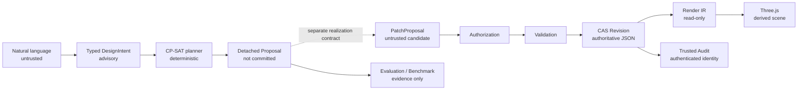
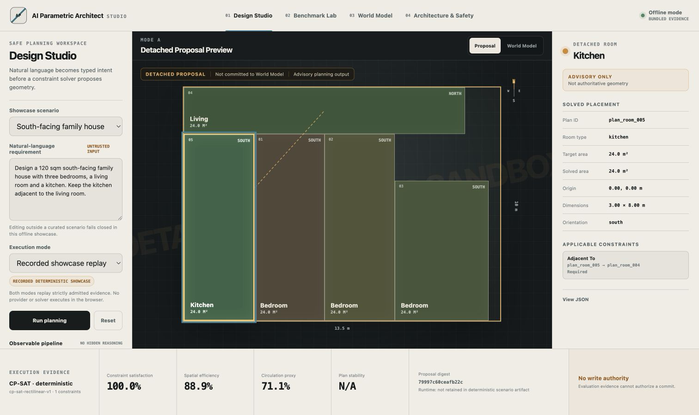
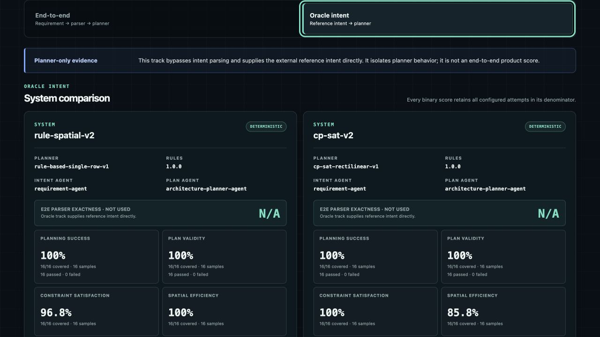
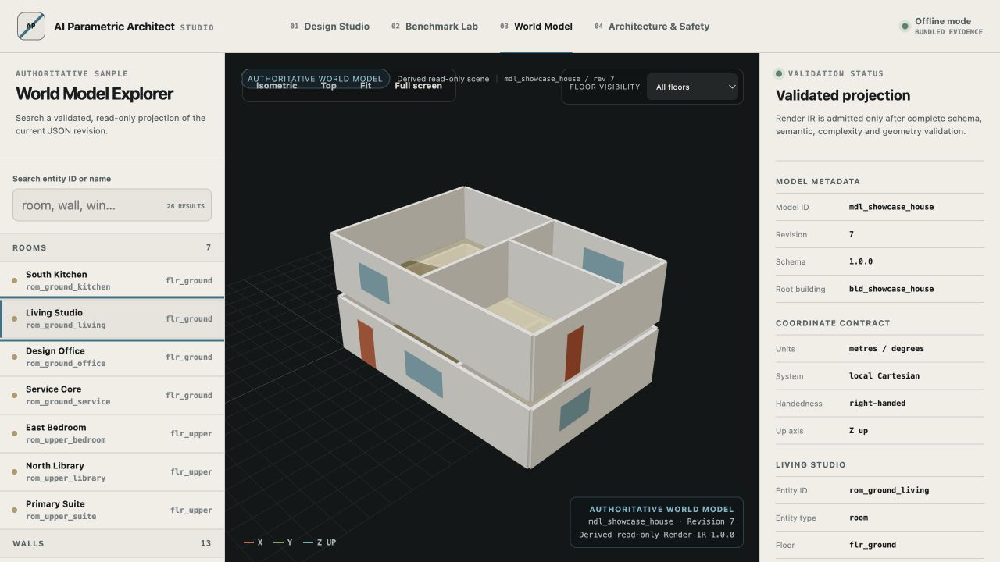
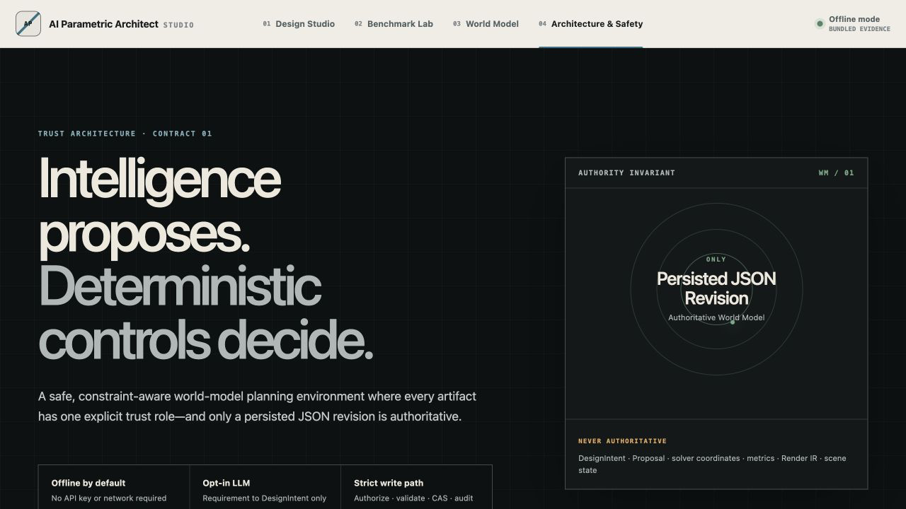

# AI Parametric Architect Studio

> A safe, constraint-aware world-model planning environment for architectural AI.

AI Parametric Architect Studio 将自然语言需求转换为类型化 `DesignIntent`，使用确定性
Constraint Solver 产生可评估的 detached Proposal，并以只读 Three.js 场景呈现已验证的
World Model。持久化 JSON Revision 始终是唯一权威模型；LLM、Solver、Benchmark、
Render IR 和前端场景都没有提交权。





## 30 秒理解产品

- **Design Studio**：回放三个离线场景，展示可观测的 DesignIntent、Solver 策略、约束数、runtime 的明确 N/A 状态和稳定失败码，不展示隐藏推理。
- **Detached Planning Sandbox**：可交互预览 `FloorPlanProposal v2`，始终显示 “Detached Proposal / Not committed / Advisory”。
- **Benchmark Lab**：对比 `rule-spatial-v2` 与 `cp-sat-v2`，区分 end-to-end 和 oracle-intent track，保留失败分母与 N/A 覆盖率。
- **World Model Explorer**：通过现有 `World Model → Render IR → Three.js` 单向链路展示已验证房间、墙体、门窗、楼层和 revision 身份。
- **Architecture & Safety**：直观说明为什么 LLM 不能直接改几何、Evaluation 不等于 Authorization，以及 CAS 如何拒绝过期写入。

## 一键离线演示

需要 Python 3.12–3.13、`uv`、Node.js `>=22.13.0` 和 npm。推荐在 macOS、Linux
或 WSL2 中运行；原生 Windows 尚未验证。

```bash
git clone https://github.com/Owenqi666/AI_Parametric_Architect.git
cd AI_Parametric_Architect

python3 --version
uv --version
node --version
npm --version

make showcase
```

首次运行会校验并安装锁定依赖。等待终端出现 Vite 的 `Local` 地址和 Uvicorn 的
`Application startup complete` 后，打开 `http://127.0.0.1:3000`。FastAPI 运行在
`http://127.0.0.1:8000`；`Ctrl+C` 会清理两个子进程。

端口被占用时可以显式覆盖：

```bash
SHOWCASE_BACKEND_PORT=8010 SHOWCASE_FRONTEND_PORT=3010 make showcase
```

锁定依赖已安装或缓存后，默认演示不需要 API key、网络、数据库或手动生成 fixture；
首次冷安装仍可能需要软件包注册表。详见[中文使用指南](docs/USER_GUIDE.zh-CN.md)和
[Showcase 指南](docs/SHOWCASE.md)。作品集文档还包括
[案例研究](docs/CASE_STUDY.md)、[架构概览](docs/ARCHITECTURE_OVERVIEW.md)、
[Benchmark 方法](docs/BENCHMARK_METHODOLOGY.md)和[演示录制脚本](docs/DEMO_SCRIPT.md)。

| Design Studio | Benchmark Lab |
| --- | --- |
|  |  |

| World Model Explorer | Architecture & Safety |
| --- | --- |
|  |  |

## 5 分钟使用指南

1. 在 **Design Studio** 保持 `South-facing family house`，点击 **Run planning**。
   查看类型化 DesignIntent，然后选择 Kitchen，确认邻接约束和三条 detached 警告。
2. 切换到 `Compact apartment`，查看 baseline 与 CP-SAT 的效率、circulation proxy
   和稳定性证据。
3. 运行 `Conflicting spatial constraints`，确认系统显示
   `PLANNING_SOLVER_FAILED`，且不生成 Proposal 或伪造指标。
4. 打开 **Benchmark Lab**，在 End-to-end 与 Oracle intent 之间切换；可使用
   **Import report** 导入通过 `BenchmarkReport 1.0.0` 严格准入的本地报告。
5. 打开 **World Model**，搜索或选择实体、切换楼层并使用 Fit/Top/Isometric；最后在
   **Architecture & Safety** 查看 Proposal、Authorization、CAS 和 Render IR 的权限边界。

注意：编辑为未收录的自然语言后，离线模式会以 `SHOWCASE_INPUT_NOT_RECORDED` 失败关闭。
这不是输入框故障，也不会静默调用网络或伪造 solver 结果。

## 技术亮点与诚实边界

- JSON Schema Draft 2020-12、语义/引用规则和 Shapely 几何验证共同构成 World Model 准入。
- JSON Patch、完整验证、revision CAS、Undo/Redo 与 trusted audit 组成唯一权威写路径。
- OR-Tools CP-SAT 只返回 detached `FloorPlanProposal v2`；Proposal preview 使用独立前端合同，从不进入 `WorldModelRenderIRProjector`。
- OpenAI Responses 适配器是显式 opt-in 且仅能返回 `DesignIntent`；本 release 的 Studio 不暴露 live 控件。
- 版本化 BenchmarkReport 导入经过 exact-field、数值有限性、资源预算与深冻结验证；评分只是证据，不是提交授权。
- 这是 production-oriented research prototype，**不声称**建筑规范合规、自动建筑正确性、AI 几何权威或可直接公网运营。当前 repository/audit 为进程内实现，流线指标中 circulation 仅是中心距离 proxy。

当前定位：**Production-oriented AI Agent Framework Prototype with constraint-aware
detached planning, evaluation, and read-only 3D visualization**。它已完成安全硬化、
Phase 7 Task 7.1–7.2、Final Enhancement Priority 1–3 与离线作品集展示层，但仍不是可直接暴露到公网的 production-ready 服务。

当前 MVP 已打通：

```text
authoritative JSON World Model
  -> JSON Schema Draft 2020-12
  -> semantic/reference validation
  -> Shapely geometry validation
       -> deterministic SVG
       -> immutable Render IR 1.0.0
            -> strict browser-side contract parser
            -> read-only Three.js scene
  -> CLI / FastAPI / viewer
```

同时已完成不依赖 LLM 的确定性编辑链路：

```text
immutable revision snapshot
  -> apply add/remove/replace JSON Patch to a copy
  -> JSON-only value guard
  -> schema + semantic + Shapely validation
  -> compare-and-swap commit
  -> append-only audit log
```

Agent Evolution Roadmap 的 proposal pipeline 和可评估基础设施也已完成：

```text
Natural Language
  -> RequirementAgent
  -> immutable DesignIntent
  -> ArchitecturePlannerAgent
  -> typed PlanningRules + SpatialConstraint
  -> deterministic OR-Tools CP-SAT solver
  -> detached spatial FloorPlanProposal v2
  -> PatchGeneratorAgent
  -> semantic-only PatchProposal + affected entity IDs
  -> validation + revision commit

Typed LLMProvider
  -> deterministic Mock for all three typed output contracts
  -> opt-in OpenAI Responses adapter for DesignIntent only
  -> Requirement / FloorPlan / Patch proposal adapters
  -> EvaluationRunner + detached full validation
  -> tenant-scoped HMAC AgentTrace correlation (no chain-of-thought)

Validation error
  -> ConstraintReasoningAgent
  -> symbolic ConstraintResolutionPlan
  -> human/later planning decision (no automatic patch)

versioned requirements dataset + separate reference annotations
  -> read-only two-track BenchmarkRunner
  -> allowlisted, redacted BenchmarkReport
```

`DesignIntent` 是进入世界模型之前的候选中间表示，不包含坐标，也不是第二个持久化世界状态。
Agent 和 planner 只能由它生成 `Plan`/`PatchProposal`；只有通过 Patch、完整模型验证和
revision commit 后，变化才成为权威 JSON 世界状态。

CP-SAT 的 `FloorPlanProposal v2` 仍是 detached Proposal：它不是 Render IR 的输入，
也不会被 Three.js 当作已提交几何显示。只有先经过授权 Patch、完整验证和 revision CAS，
进入权威 JSON World Model 的几何才可能被 Render IR 投影。

本版本包含真实 OpenAI Responses API 适配器，但不会由默认 composition、常规 CLI、FastAPI
或 benchmark CLI 的默认模式自动启用；真实适配器只做 requirement → `DesignIntent`，不会生成
FloorPlan、Patch 或读取 World Model。`MockLLMProvider` 继续覆盖全部三个 typed contract 的确定性测试。
当前仍不包含 Multi-Agent、自动修正、DXF、IFC 或规范 RAG。

当前硬化里程碑将所有输入统一到严格 JSON trust boundary，对模型与 Patch
执行计算预算，以防御性快照修复 Revision 初始化 TOCTOU，并将 Agent 提交、
审计主体与 Trace 分别收口到授权策略、可信身份和 tenant HMAC 边界。
详见 [Security.md](Security.md)。

## 环境与安装

需要 `uv`。默认开发环境使用 Python 3.13，包支持 Python 3.12–3.13，CI 会验证
两个版本；运行时与开发依赖通过 `uv.lock` 锁定。CP-SAT 固定使用
`ortools==9.15.6755`，支持项目 CI 使用的 CPython macOS/Linux wheel；当前不声明
Alpine/musl 或 PyPy 支持。

```bash
uv sync --dev --locked
```

Three.js viewer 需要 Node.js `>=22.13.0`；CI 使用 Node 24，前端依赖由
`frontend/package-lock.json` 锁定。

## 运行

启动 FastAPI：

```bash
uv run uvicorn ai_parametric_architect.backend.api:app --reload
```

接口：

- `GET /health`
- `GET /v1/capabilities`（仅返回安全的功能布尔值）
- `POST /v1/models/validate`
- `POST /v1/models/render/svg`
- `POST /v1/models/render/ir`
- `POST /v1/models/render/ir?floor_id=<floor-id>`

Render IR 成功响应是 `application/json`。无效模型、未知楼层和无可视几何分别以稳定 issue
code 返回结构化 `422` 报告。

验证有效模型：

```bash
curl -sS -X POST http://127.0.0.1:8000/v1/models/validate \
  -H 'Content-Type: application/json' \
  --data-binary @examples/valid_simple_house.json
```

验证重叠房间 fixture（返回 `ROOM_OVERLAP`）：

```bash
curl -sS -X POST http://127.0.0.1:8000/v1/models/validate \
  -H 'Content-Type: application/json' \
  --data-binary @examples/invalid_overlap.json
```

渲染 SVG：

```bash
curl -sS -X POST http://127.0.0.1:8000/v1/models/render/svg \
  -H 'Content-Type: application/json' \
  --data-binary @examples/valid_simple_house.json \
  --output simple_house.svg
```

生成版本化 Render IR：

```bash
curl -sS -X POST http://127.0.0.1:8000/v1/models/render/ir \
  -H 'Content-Type: application/json' \
  --data-binary @examples/valid_simple_house.json \
  --output simple-house.render-ir.json
```

CLI 提供同一条确定性链路：

```bash
uv run ai-architect validate examples/valid_simple_house.json
uv run ai-architect render-svg examples/valid_simple_house.json simple_house.svg
```

## Three.js World Model Visualization（Final Enhancement Priority 1）

`RenderIR 1.0.0` 是从已通过完整验证的 World Model 投影出的不可变、版本化、确定性可视化
合同。它保留源模型的 `schema_version`、`model_id`、`revision` 和
`root_building_id`，并保持模型原生 right-handed、Z-up、米/度坐标约定，不把 Three.js
运行时坐标解释为新的几何权威。

当前投影和 viewer 支持：

- room polygon surface、wall vertical extrusion，以及 door/window opening panel；
- 后端按楼层投影、前端楼层可见性切换；
- isometric/top camera、orbit/zoom、entity selection 和只读属性检查；
- 从 `entity_id` 到 scene object 的稳定映射。

Viewer 只接收 Render IR，不读取或修改原始 World Model，不生成 Patch，不访问 repository，
也没有 authorization 或 revision commit 能力。当前 v1 不显示 stair；门窗以 panel 表示，
不会通过 CSG 修改墙体。默认演示加载同源静态 fixture
`frontend/public/examples/showcase-house.render-ir.json`，Python 集成测试会核对它与后端
projector 的输出；默认页面不会自行向 POST API 提交 World Model。

启动 viewer：

```bash
cd frontend
npm ci
npm run dev
```

## Real LLM Adapter（Final Enhancement Priority 2）

`OpenAIResponsesProvider` 位于 `infrastructure/llm`，使用 Responses API strict JSON Schema，
但仍通过 provider-neutral `LLMProvider` 返回精确的不可变 `DesignIntent`。它不开放真实网络的
FloorPlan 或 Patch 输出；这两种 `LLMOutputKind` 会在网络调用前 fail closed。成功响应还必须在
本地依次通过严格 JSON 解码（拒绝重复 key、非有限数、trailing text）、响应字节预算、
`IntentValidator` 和 `DesignIntent.from_dict()`，供应商的 structured-output 保证不是信任边界。

真实解析只能显式创建，现有 `create_requirement_agent()` 和所有默认服务保持不联网：

```python
import os

from ai_parametric_architect.composition import (
    create_architecture_planner_agent,
    create_openai_requirement_agent,
)
from ai_parametric_architect.infrastructure import OpenAIProviderConfig

requirement_agent = create_openai_requirement_agent(
    OpenAIProviderConfig(model=os.environ["OPENAI_MODEL"])
)
intent = requirement_agent.run("Create a 120 sqm three bedroom house")
proposal = create_architecture_planner_agent().run(intent)
```

OpenAI SDK 从 `OPENAI_API_KEY` 读取凭据；key 不属于 config、prompt、错误或 trace。model 必须由
可信部署配置显式给出，生产环境应固定经过验证且支持 Structured Outputs 的 snapshot。
请求禁用 tools，设置 `store=False`、`truncation="disabled"`、有限 timeout/token/byte budget，
SDK retry 默认是 0（可信部署最多可显式设为 2）。所得 CP-SAT `proposal` 仍是 detached v2
建议，不能进入 Render IR，也不会创建 committed geometry。

## Planning Benchmark Framework（Final Enhancement Priority 3）

`ai_parametric_architect.benchmark` 的顶层 API 是只读、authority-neutral 的基准包：它公开
不可变数据/报告合同和一个只具有 `run()` 的 detached runner。顶层导入不会加载 OR-Tools；
parser、planner 和 monotonic clock 都在 composition 边界注入，核心 runner 不持有 provider、
repository、Patch、validation、revision、authorization 或 commit 能力。

基准输入严格拆成两个独立的 `1.0.0` artifact：

- dataset 只含排序后的 case ID/tags 和不可信自然语言 requirement；
- annotation set 只含外部 reference intent/constraints，并绑定 dataset ID/version，且必须对 case
  做精确一对一覆盖。

两份合同都使用 exact-field、标准 JSON、不可变值和独立版本号，并从规范化内容计算 canonical
SHA-256 digest。加载器限制单文件为 1 MiB、最多 64 个 case、单 requirement 最多 16 KiB；
runner 还会在调用 clock 或 Agent 前检查完整的 `cases × systems × trials` 预算。CLI 的固定预算是
16 cases、3 systems、4 trials、192 attempts，并随 metric context 一起写入报告，便于比较结果。

使用仓库标准 fixture 运行默认离线 benchmark：

```bash
uv run ai-architect-benchmark \
  benchmarks/datasets/planning-core-1.0.0.json \
  benchmarks/annotations/planning-core-reference-1.0.0.json \
  planning-benchmark-report.json \
  --trials 2
```

内置 composition 提供三个可比较系统（runner 也可接受其他满足窄 port 的注入系统）：

- `rule-spatial-v2`：确定性 rule parser + 独立的单排空间 baseline；
- `cp-sat-v2`：同一确定性 rule parser + CP-SAT v2 planner；
- `openai-cp-sat-v2`：真实 OpenAI intent parser + 同一 CP-SAT planner，仅显式 opt-in。

新的 `RuleBasedSpatialFloorPlanPlanner` 不依赖 OR-Tools，按 intent 稳定顺序和等面积目标生成
`FloorPlanProposal v2`；它不会替换或改写既有 semantic-only
`RuleBasedFloorPlanPlanner` v1/`equal-area-stable-order-v1` 路径。系统 descriptor 会记录 Agent/system
版本、planner strategy、rules version、seed 和 execution mode；真实系统还记录 provider、model
和 prompt version。

每个 system/case/trial 同时运行两条轨道：`end_to_end` 将 dataset requirement 交给 parser，再把
解析 intent 交给 planner；`oracle_intent` 完全绕过 parser，将 annotation 中的 reference intent
只交给同一个 planner，从而隔离规划质量。reference intent/constraints 从不进入 end-to-end parser。
标准 fixture 特意在显式房间列表后使用位置式关系描述，以避免房间语法成为混杂因素，同时暴露
当前确定性 parser 不提取 spatial constraints 的已知缺口；oracle 轨道则在相同 reference intent
上比较两个 planner。

报告汇总 exact intent accuracy、planning success、plan validity、constraint satisfaction、spatial
efficiency、circulation、repeated-run stability，以及 parse/plan/total runtime 的 min/median/p95/max/
total。二元指标以所有 attempt 为分母；每个 metric/runtime 另带 `attempt_count`、
`covered_attempt_count`、`sample_count` 和 coverage，避免把失败或不适用样本静默排除。end-to-end
空间分数只覆盖 exact-reference-intent 的成功 proposal；稳定性按同 case 的重复运行对计样本。
默认 systems 的 proposal 可复现不代表整份报告逐字节固定，因为 production clock 记录的是实际
运行时间。

`BenchmarkReport` 只序列化 allowlisted 身份、版本/digest、预算/context、系统描述、计数/分数、
proposal digest、纳秒 timing 和脱敏的 failure `stage/code/path`。它不保留 raw requirement、reference
answer、typed intent/plan、provider output/messages、prompt、exception message/details 或 credential
字段。descriptor/ID/model/context 等 allowlisted metadata 仍由可信调用方声明，可能敏感且不得放入
secret。
dataset/annotations、`FloorPlanProposal` 和 report 都只是 detached evidence，不是 World Model、
revision、authorization evidence 或 commit input；P3 没有改变既有 validation、revision、
authorization 或 commit 边界。

只有显式增加 `--openai-model <approved-model-snapshot>` 才会加入第三个系统，凭据仍由 OpenAI SDK
从 `OPENAI_API_KEY`（或等价的受管 secret channel）读取。本文不声称执行过真实 OpenAI 网络
benchmark；自动化验收使用替身 client 验证 opt-in、请求和脱敏边界。

## Revision 与 JSON Patch

`ModelRevision` 是权威 JSON 快照外的不可变信封，包含 `model_id`、
`revision_number`、带时区的 `created_at` 和 `parent_revision`。
`revision_number` 始终与快照中的 `revision` 相等；几何和实体数据仍只存在于 JSON。

当前 Patch 引擎是明确的 RFC 6902 子集，支持 `add`、`remove`、`replace`；
不宣称支持 `copy`、`move` 或 `test`。引擎严格解析 RFC 6901 JSON Pointer，
且整个 Patch 原子地作用于深拷贝。根删除被拒绝；应用层另外保护根路径、
`model_id`、`revision`、`schema_version` 和 `geometry_settings`，版本号只能由提交流程递增，
几何候选数据也不能在同一 Patch 中放宽自己的精度验收策略。
所有进入历史的状态还必须是无循环、无共享容器引用且深度受控的标准 JSON 树。

Python 应用服务示例：

```python
import json
from pathlib import Path

from ai_parametric_architect.composition import create_editing_service
from ai_parametric_architect.domain import (
    AuditActorType,
    PatchOperation,
    PatchProposal,
    TrustedAuditIdentity,
)

model = json.loads(Path("examples/valid_simple_house.json").read_text(encoding="utf-8"))
editing = create_editing_service()
identity = TrustedAuditIdentity(
    actor_id="architect-7",
    actor_type=AuditActorType.HUMAN,
    trace_id="request-018f6d91",
)
editing.initialize(
    model,
    provenance="import:file",
    rationale="Create revision history.",
    audit_identity=identity,
)

revision = editing.apply_patch(
    "mdl_simple_house",
    PatchProposal(
        base_model_id="mdl_simple_house",
        base_revision=0,
        operations=(
            PatchOperation(
                "replace",
                "/metadata/description",
                "Updated through JSON Patch.",
            ),
        ),
        provenance="ui:manual-edit",
        rationale="Update the model description.",
    ),
    audit_identity=identity,
)

undone = editing.undo(
    revision.model_id,
    expected_revision=revision.revision_number,
    provenance="ui:manual-edit",
    rationale="Undo the description edit.",
    audit_identity=identity,
)
```

`undo` 和 `redo` 不移动或覆盖旧快照，而是提交新的补偿版本，因此 revision
始终单调递增。恢复候选会先按当前 Schema 与几何规则重新校验，再以 CAS 提交。
普通 Patch 在成功提交后清空 redo 分支；被拒绝的 Patch、
冲突和校验失败都不改变快照、历史栈或 audit log。

默认 `InMemoryRevisionRepository` 仅适合单进程运行与开发测试：进程重启后数据不保留，
也不在多进程间共享。`RevisionRepository` 端口已保留给未来的持久化适配器；
新适配器必须以 CAS 方式原子更新 snapshot、head、undo/redo 栈和 audit entry。
本阶段未添加 Patch HTTP 端点。

`TrustedAuditIdentity` 必须由认证后的应用上下文单独传入每个写操作。
Proposal 中的 provenance/rationale 只是不可信说明，不能声明 human 身份；
Audit 序列化会将它们明确标记为 `untrusted_provenance` 和
`untrusted_rationale`。

## Production-oriented Hardening

`StrictJsonTreeGuard` 是 API、Validator、EditingService 和 Evaluation 的统一
JSON 可信边界。它只接受无循环、无容器别名的标准 JSON 树，并拒绝
`NaN`/`Infinity`、datetime、set、tuple、custom object 和非字符串 key。
因此 Validator 接受的未变更模型也一定能进入 Revision 快照。

`ModelComplexityPolicy` 统一限制 entity 总数、polygon 顶点、坐标幅度、
room area、wall length 和 Patch operation 数。默认值是原型的安全边界，
可通过依赖注入收紧；它们不是建筑规范限值。超限会在昂贵的 Shapely
计算前返回稳定 issue code。HTTP adapter 另有默认 2 MiB body-size 上限，超限返回
`413` / `REQUEST_BODY_TOO_LARGE`。

Agent 产生的 Proposal 不能直接获得 commit 权限。
`AgentAuthorizationGateway` 先使用确定性 policy 检查 intent alignment、
model/revision binding、allowed operation/path/entity 以及 affected entities，随后才会调用
Validation 和 CAS commit。Evaluation 结果不是该 gateway 的输入类型，
因而不能被当作授权凭据。

## Design Intent Layer（Roadmap Task 1）

`ai_parametric_architect.intent` 提供与 LLM/供应商无关的 Task 1 合同：

- `DesignIntent`：建筑类型、目标面积、房间需求、可选朝向和空间约束。
- `RoomRequirement`：紧凑的 `{room_type, count}` 表示。
- `SpatialConstraint`：两个已请求房间类型之间的邻接、远近、分隔或相对方向关系。
- `IntentValidator`：先验证标准 JSON 和 Draft 2020-12 Schema，再执行不可由 Schema
  完整表达的语义约束；输入不会被归一化或修改。

规范输出继续使用展开的 `rooms` 数组，保持与现有 PlanningRecord 兼容：

```json
{
  "building_type": "house",
  "area": 120,
  "rooms": ["living", "bedroom", "bedroom", "kitchen"],
  "orientation": "south",
  "spatial_constraints": [
    {
      "source_room_type": "kitchen",
      "relation": "adjacent_to",
      "target_room_type": "living",
      "required": true
    }
  ]
}
```

也可输入等价的紧凑 `room_requirements`；两种表示严格二选一，并归一为同一个不可变
`DesignIntent`。空间关系只能引用已请求的不同房间类型。当前 v1 支持
`adjacent_to`、`near`、`separated_from` 和四个相对方向关系。

```python
from ai_parametric_architect.intent import (
    DesignIntent,
    IntentValidator,
    RoomRequirement,
    SpatialConstraint,
)

intent = DesignIntent(
    building_type="house",
    area=120,
    room_requirements=(
        RoomRequirement("living"),
        RoomRequirement("bedroom", 3),
        RoomRequirement("kitchen"),
    ),
    orientation="south",
    spatial_constraints=(
        SpatialConstraint(
            source_room_type="kitchen",
            relation="adjacent_to",
            target_room_type="living",
        ),
    ),
)

assert IntentValidator().validate(intent.to_compact_dict()) == ()
```

Schema 的版本资源位于
`ai_parametric_architect/intent/schemas/design-intent-1.0.0.schema.json`，会与世界模型
Schema 一起打包并在隔离 wheel 安装后验证。

## Requirement Agent（Roadmap Task 2）

Task 2 已通过一个 provider-neutral 的泛型 `Agent[Input, Output]` 协议和冻结的
`RequirementAgent` 落地。Requirement Agent 只接收原始自然语言并返回经过领域约束的
`DesignIntent`；它不接收 model document、revision repository 或 editing service，也不保存
会话状态。当前生产组合点注入 deterministic `RuleBasedRequirementParser`，没有真实 LLM。

```python
from ai_parametric_architect.composition import create_requirement_agent

agent = create_requirement_agent()
intent = agent.run("Create a 120 sqm three bedroom house")

assert intent.to_dict() == {
    "building_type": "house",
    "area": 120,
    "rooms": ["bedroom", "bedroom", "bedroom"],
    "orientation": None,
}
```

当前 rule grammar 只对明确支持的中英文建筑类型、平方米单位、房间类型/数量和四个基本
朝向作确定性解析；冲突、歧义、面积口径和尚未支持的限定关系会结构化拒绝，而不是猜测。
`RequirementAgent.parse()` 适配现有 `RequirementParser` port，因此完整 planning pipeline 已
实际经过 Agent 边界。

## Architecture Planner Agent（Roadmap Task 3）

Task 3 在 `DesignIntent` 与世界模型 Patch 之间增加了独立、不可变的
`FloorPlanProposal` Plan IR。Phase 7 Task 7.1 将 production composition 从简单等面积
规则升级为整数网格 OR-Tools CP-SAT 求解器。`ArchitecturePlannerAgent` 仍只接收
intent，不接收 model document、revision 或 repository；没有新增 Agent。

```python
from ai_parametric_architect.composition import (
    create_architecture_planner_agent,
    create_requirement_agent,
)

intent = create_requirement_agent().run("Create a 120 sqm three bedroom house")
plan = create_architecture_planner_agent().run(intent)

assert [room.plan_id for room in plan.rooms] == [
    "plan_room_001",
    "plan_room_002",
    "plan_room_003",
]
assert plan.schema_version == "2.0.0"
assert plan.strategy == "cp-sat-rectilinear-v1"
assert plan.boundary is not None
assert all(room.is_placed for room in plan.rooms)
```

Proposal 合同严格版本化：

- v1 `1.0.0` 保留原始 semantic-only 三字段 room JSON，供兼容测试和显式 legacy
  adapter 使用；它不会悄悄出现可选坐标。
- v2 `2.0.0` 强制每个 room 完整携带 `x/y/width/height/orientation`，并携带
  proposal-local rectangular boundary。缺字段、非有限值、越界、重叠或朝向暴露不一致
  都会被拒绝。

`cp-sat-rectilinear-v1` 使用唯一的 `PlanningGridPolicy` 和可注入 `PlanningRules`：

- Decision variables：每个 room 的整数网格 `x/y/width/height` 与边界朝向。
- Hard constraints：最小房间面积、边界、`NoOverlap2D`、正共享边邻接、净距分离，
  以及 `near`/四个相对方向。
- Soft objectives：空间利用、目标面积偏差、包围盒紧凑度、房间中心 Manhattan 距离
  的 circulation proxy、朝向偏好和 optional spatial constraint。
- Determinism：稳定 ID/建模顺序、同类房间对称性约束、单 worker、固定 seed、
  deterministic-time budget、有界整数目标和稳定 tie-break；只接受 `OPTIMAL`，不会在
  `FEASIBLE`/`UNKNOWN`/`INFEASIBLE` 时回退到 legacy 规则。

原 `equal-area-stable-order-v1` 仍作为显式兼容 planner 保留，但不再是 production
composition 默认值。类型级空间约束仍稳定绑定到该房型的第一个计划房间，因为
DesignIntent v1 尚无实例 selector。

求解坐标是 detached Proposal，不是权威几何。当前 patch rule 只把 plan 的房间语义
映射到 revision 中已有的 room slots，并生成 `name`/`usage` 与 owned planning record 的
`PatchProposal`。它不会生成 `/geometry` 操作；authorization allowlist 也未放宽。
因此提交后现有 World Model geometry 逐字节不变，area/orientation/spatial constraints
仍记录为 `unverified_constraints`，直到未来有独立授权且经完整几何验证的 realization
流程。

当前求解范围有意保守：只处理 proposal-local、轴对齐矩形；边界来自显式规则中的
固定尺寸或版本化 utilization/aspect 推导策略。circulation 只是中心距离代理，不是门、
走廊、可达图或疏散分析；最小面积默认值是 planning policy，不是建筑规范结论。

Phase 7 当前完成 Task 7.1–7.2；Final Enhancement Priority 2–3 已分别以 DesignIntent-only
OpenAI adapter 和 detached planning benchmark 完成 Task 7.4–7.5。Task 7.3 knowledge layer
和 Task 7.6 proposal evaluation loop 仍待后续实施。

## Constraint Reasoning Agent（Roadmap Task 4）

Task 4 把单个 error 级 `ValidationIssue` 转换为不可执行的候选解 Plan，不尝试
自动修正。`ConstraintReasoningAgent` 不读 model document 或 repository；它仅保留
issue identity，并返回版本化、可机器读取的 `ConstraintResolutionPlan`。

```python
import json
from pathlib import Path

from ai_parametric_architect.composition import (
    create_constraint_reasoning_agent,
    create_service,
)

model = json.loads(Path("examples/invalid_overlap.json").read_text(encoding="utf-8"))
report = create_service().validate(model)
issue = next(issue for issue in report.issues if issue.code == "ROOM_OVERLAP")
plan = create_constraint_reasoning_agent().run(issue)

assert [candidate.action.value for candidate in plan.candidates] == [
    "resize_room",
    "change_layout",
]
```

当前保守 rule set 只对能安全定位的两类问题提供备选方向：

- `ROOM_OVERLAP` → `resize_room` / `change_layout`
- `WALL_ZERO_LENGTH` → `move_wall` / `change_layout`

已知 code 还必须与 validator 产生的 RFC 6901 registry path 和 entity 数量一致。
未知 issue、非 error issue 或无法安全定位 entity 的情况不会被猜测：输出
`manual_review_required` 或结构化拒绝。`CandidateSolution` 只包含 action、受影响
entity IDs 和 rationale；不包含坐标、模型、revision 或 Patch operations。
它属于用于决策的 Plan，必须由后续 Task 5 Patch Generator 将选定方案显式转换为
`PatchProposal`，并继续经过完整 Validation 和 Revision Commit；当前未实现该自动闭环。
当前 reasoning Plan 也不绑定 model revision，因此不能直接作为可执行 Patch 的授权或防冲突依据。

## Patch Generator Agent（Roadmap Task 5）

Task 5 将 Plan 到 Patch 的转换从 planner 中显式分离为 Agent 边界。
`PatchGenerationRequest` 把一个 `FloorPlanProposal` 与它当前的不可变
`ModelRevision` 配对，避免依赖隐式或过期上下文：

```python
from ai_parametric_architect.agents import PatchGenerationRequest
from ai_parametric_architect.composition import (
    create_architecture_planner_agent,
    create_patch_generator_agent,
    create_requirement_agent,
)

intent = create_requirement_agent().run("Create a 120 sqm three bedroom house")
plan = create_architecture_planner_agent().run(intent)
proposal = create_patch_generator_agent().run(
    PatchGenerationRequest(plan=plan, current_revision=current_revision)
)
```

Patch Agent 本身不可调用 patch engine、validator、repository 或 commit。它会拒绝：

- 与 request model 不匹配的 `base_model_id`；
- 与 request revision 不匹配的 `base_revision`；
- 没有 `affected_entity_ids` 的 proposal；
- 引用当前 revision 中不存在 entity 的 proposal；
- 类型不符合 port 合同的 request 或 generator 输出。

当 intent 已由当前模型实现时，输出 `None` 作为明确的 no-change，不生成空 Patch。
当前 deterministic generator 只允许 room `name`/`usage` 和 owned planning trace；
应用层不信任该元数据：它会从验证后的 before/after JSON 实体差量独立推导
affected IDs，并要求与 proposal 完全一致；只有这份已验证集合会写入 audit details。
`base_model_id` 和 `base_revision` 同时绑定提案来源快照，防止相同修订号的跨模型重放。
对显式 no-change，提交用例会在返回前重读 head；规划期间若修订已前进，则返回
`REVISION_CONFLICT`，不会把过期快照报告为当前无变更结果。

Agent 输出仍然只是 proposal。只有 `ArchitecturePlanningService.plan_and_commit()` /
`EditingService.apply_patch()` 才能执行 copy → Schema/semantic/Shapely validation → CAS commit。
因此“必须通过验证”是提交边界的硬约束，不是 Agent 对自己输出的声明。
Task 4 `ConstraintResolutionPlan` 尚未绑定 revision，所以 Task 5 不接受它作为可执行输入。

## LLM Adapter Layer（Task 6.1）

`ai_parametric_architect.llm` 是无供应商 SDK 的 typed adapter 边界。`LLMProvider.complete()`
只能返回三种精确、不可变的值类型：

- `DesignIntent`
- `FloorPlanProposal`
- `PatchProposal`

`StructuredPrompt` 将期望输出类型和 prompt 绑定；运行时会拒绝任意 mapping、
错误类型和允许类型的 subclass。三个窄适配器分别实现现有的
`RequirementParser`、`FloorPlanPlanner` 和 `PatchProposalGenerator` 端口形状，
因此可注入现有 Agent，但没有 repository、patch apply 或 commit 方法：

```python
from ai_parametric_architect.agents import RequirementAgent
from ai_parametric_architect.domain import DesignIntent
from ai_parametric_architect.llm import LLMRequirementParser, MockLLMProvider

expected = DesignIntent(building_type="house", area=120, rooms=("bedroom",) * 3)
provider = MockLLMProvider((expected,))
agent = RequirementAgent(LLMRequirementParser(provider))

assert agent.run("设计一个120平方米三室住宅") is expected
```

FloorPlan prompt 只包含经验证 intent；Patch prompt 接收显式传入的 detached
`ModelRevision` 防御性快照，但只向 provider 投影 `base_model_id` / `base_revision`、
owned planning record 和现有 room slot 的必要语义字段。坐标、metadata 和任意
extension 内容不会进入 prompt。
真实 OpenAI provider 只接收自然语言 requirement，只返回经本地二次验证的
`DesignIntent`。它没有 revision、World Model、repository、authorization、Patch 或 commit
依赖；供应商拒绝、不完整响应、网络失败和无效 JSON 使用稳定、脱敏的 provider-neutral
错误码。Mock 仍可显式测试 FloorPlan/Patch 合同，但真实网络能力没有扩展到这两个类型。

## Agent Evaluation Framework（Task 6.2）

`Scenario` 是严格、不可变的三字段合同：

```json
{
  "input_requirement": "Create a 60 sqm one bedroom house",
  "expected_intent": {
    "building_type": "house",
    "area": 60,
    "rooms": ["bedroom"],
    "orientation": null
  },
  "expected_constraints": []
}
```

`EvaluationRunner` 通过窄 port 依次评估 intent、plan 和 patch，汇总：

- `intent_extraction_accuracy`：与 expected intent 的 scenario-level 精确匹配率。
- `plan_validity`：plan 保留 intent、房间和空间约束的比率。
- `patch_validation_success_rate`：patch 经 detached copy、完整 Schema/semantic/
  Shapely 验证和 affected-entity 差量核对后成功的比率。

`DetachedPatchValidator` 仅依赖 `PatchEngine` 和 `Validator` ports，不接触 repository，
不提交 revision。评估报告保留可观察的 typed outputs、issue codes 和结构化阶段失败；
未预期的依赖 bug 会原样向上抛出，不会被 broad exception 隐藏。

### Planning Evaluation Upgrade（Phase 7 Task 7.2）

`PlanningMetricsEvaluator` 是与原 `EvaluationRunner` 并行的纯评估边界。它只接收
已经生成的 `FloorPlanProposal` 序列，不重跑 Agent/LLM，不应用 Patch，也不读写
repository。同一批次必须保留完全相同的 `DesignIntent`，并使用显式、不可变的
`PlanningMetricContext`，其中包含可比较的规则 ID、最小面积/邻接/分隔/近邻阈值、
`GeometryPrecisionPolicy` 和最大运行数。

报告 schema v1 输出四个 `[0, 1]` 指标：

- `constraint_satisfaction_score`：逐项计算房间最小面积、边界、房间对不重叠和
  每个声明的空间关系（含 optional 偏好）的成功比例。
- `spatial_efficiency_score`：净房间面积之和除以 proposal boundary 面积。
- `circulation_score`：基于房间中心成对 Manhattan 距离的明确代理指标；它不是
  门/走廊路径、无障碍或疏散验证。
- `plan_stability_score`：对同 Intent 所有运行对的边界、归一化房间布置、朝向、ID
  和约束绑定做对称比较；完全一致为 `1.0`。

v1 semantic-only Proposal 不伪造空间分数，而是返回 `SOLVED_LAYOUT_REQUIRED`；
只有一次 v2 运行时，稳定性返回 `REPEATED_PLANS_REQUIRED`。报告无 timestamp，
可以严格 JSON 序列化。所有分数只是 Proposal 比较证据，不是 authorization、
validation 或 commit 权限。

## Agent Trace（Task 6.3）

`AgentTraceRecorder` 只记录 observable execution metadata：Agent name/version、输入/
输出 tenant-scoped HMAC-SHA-256、tenant/key ID、输入/输出域、trace ID、
tool name/status/sequence 和可注入时钟生成的 UTC timestamp。
Trace 不保存 prompt、输入/输出正文、tool arguments/results、rationale、reasoning 或
chain-of-thought。它不是世界模型，也不具有 patch/repository/commit 能力。
HMAC 仅用于 correlation/integrity，不是匿名化或隐私保护；tenant key 必须由
外部 secret manager 提供并按 key ID 轮换。

Task 6.1–6.3 的端到端验收使用 Mock provider 经过现有三个 Agent、评估完整
Patch 验证、生成无正文 trace，最后由独立的 `EditingService` 执行可信提交。
LLM 适配器本身在整个过程中始终没有提交权限。

## 验证结果

每个问题都使用稳定、可机器读取的结构：

```json
{
  "code": "OPENING_OUT_OF_WALL_BOUNDS",
  "severity": "error",
  "path": "/entities/doors/dor_outside",
  "entity_ids": ["dor_outside", "wal_short"],
  "message": "Opening 'dor_outside' lies outside host wall 'wal_short'.",
  "details": {}
}
```

L1 当前覆盖有限坐标、闭合/有效 polygon、自相交、零面积、零长度墙和楼梯。
L2 当前覆盖 key/id 一致性、全局 ID 唯一性、引用完整性、房间重叠、门窗宿主、
门窗边界和门窗重叠。所有容差判断统一经过 `GeometryPrecisionPolicy`。

存在任何 error issue 时，应用服务、`/v1/models/render/svg` 和
`/v1/models/render/ir` 都拒绝产生派生输出并返回同一报告结构。

## 测试与质量门禁

```bash
uv run ruff check .
uv run ruff format --check .
uv run mypy
uv run pytest --cov=ai_parametric_architect --cov-report=term-missing
uv run coverage json -o coverage.json
uv run python scripts/verify_branch_coverage.py
```

前端质量门禁：

```bash
cd frontend
npm ci
npm run typecheck
npm run lint
npm test
npm run build
```

覆盖率配置启用 branch coverage，并单独检查 branch-only 覆盖率不低于 85%。
CI 还会构建 wheel、逐字节检查 World Model 与 Design Intent 两份版本化 Schema，
在隔离环境安装 wheel 后再次加载两份资源，并通过独立 `visualization` job 运行前端门禁。

## 目录

```text
src/ai_parametric_architect/
  agent_trace/       tenant HMAC correlation and content-free tool-call traces
  agents/            Requirement, Planner, Reasoning and Patch Generator agents
  application/       use cases and strict JSON input
  backend/           FastAPI adapter
  benchmark/         versioned datasets/references and detached two-track reports
  contracts/         versioned JSON Schema loader and resources
  domain/            revisions, patches, audit, issues, precision policy and immutable Render IR
  editing/           strict JSON Pointer and atomic JSON Patch engine
  evaluation/        scenarios, detached validation runner and planning metrics
  geometry_engine/   Shapely adapter; Shapely objects stay here
  infrastructure/    UTC/monotonic clocks and opt-in OpenAI Responses adapters
    llm/              vendor SDK/network boundary; DesignIntent extraction only
  intent/            versioned Design Intent models, Schema and validator
  llm/               typed provider contract, prompts, adapters and Mock provider
  planning/          parsers, versioned Plan IR, CP-SAT solver and safe patch planning
    solver/          integer variables, hard constraints, soft optimizer and solver adapter
  policy/            deterministic Agent proposal authorization policies
  ports/             stable geometry/rendering/editing/planning/reasoning interfaces
  reasoning/         symbolic validation-error alternatives; never executable edits
  repositories/      thread-safe in-memory revision history adapter
  renderer/          deterministic SVG and World Model Render IR projectors
  validation/        structural, L1 and L2 rules
benchmarks/           separate versioned planning datasets and reference annotations
examples/             valid and invalid acceptance fixtures
frontend/             Studio shell, strict Proposal/Benchmark/Render IR admission, Three.js read-only UI
  public/examples/    backend-synchronized Render IR demonstration fixture
tests/                contract, unit, integration, API and architecture tests
tests/security_tests/ adversarial trust-boundary and concurrency regressions
```

详细依赖方向和未来扩展边界见 [architecture.md](architecture.md)；
威胁模型、信任边界和部署限制见 [Security.md](Security.md)。
