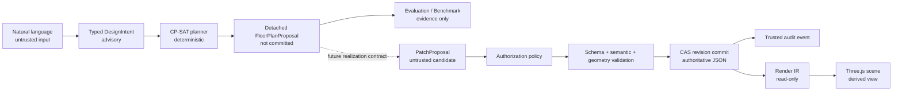

# AI Parametric Architect Studio

> A safe, constraint-aware world-model planning environment for architectural AI.

AI Parametric Architect Studio converts natural-language requirements into typed architectural intent, generates deterministic floor-plan proposals with OR-Tools CP-SAT, evaluates those proposals, and visualizes validated world-model revisions through a read-only Three.js interface.

The project is built around one rule:

> **Persisted JSON revisions are the only authoritative world model.**

LLM responses, solver layouts, benchmark reports, Render IR, SVG output, and Three.js scenes are all derived or advisory artifacts. None of them can directly mutate or commit authoritative geometry.


---

## Why This Project Exists

Many AI design systems allow a language model to generate geometry and write it directly into application state. That approach is difficult to validate, reproduce, audit, or secure.

AI Parametric Architect separates language understanding, spatial planning, validation, authorization, persistence, evaluation, and visualization into explicit boundaries:



This architecture makes the system useful not only as an architectural prototype, but also as a reference implementation for safe AI planning over structured world models.

---

## Project Status

**Current maturity**

> Production-oriented AI Agent Framework Prototype with constraint-aware detached planning, evaluation, and read-only 3D visualization.

Completed capabilities include:

- JSON-first authoritative world model
- JSON Schema Draft 2020-12 validation
- semantic and cross-reference validation
- Shapely-based geometry validation
- deterministic SVG rendering
- immutable Render IR 1.0.0
- read-only Three.js visualization
- JSON Patch with `add`, `remove`, and `replace`
- immutable revision history with compare-and-swap
- compensating undo and redo
- trusted audit identity
- typed Requirement, Planning, Reasoning, and Patch Generator agents
- deterministic OR-Tools CP-SAT floor-plan planning
- detached planning metrics
- rule-based and CP-SAT benchmark systems
- opt-in OpenAI Responses adapter for `DesignIntent` extraction only
- tenant-scoped HMAC trace correlation
- offline showcase application and portfolio documentation

This repository is **not** a production-ready public service. It does not claim:

- building-code compliance
- automatic architectural correctness
- authoritative AI-generated geometry
- durable multi-process persistence
- public-internet readiness
- automatic proposal realization
- IFC or DXF export
- production RAG
- unrestricted multi-agent autonomy

---

## Product Experience

The showcase application contains four main workspaces.

### Design Studio

The Design Studio presents recorded deterministic scenarios and exposes the observable planning stages:

```text
Requirement
  -> DesignIntent
  -> CP-SAT planning
  -> Detached FloorPlanProposal
  -> Planning metrics
```

The proposal preview is clearly labelled:

- **Detached Proposal**
- **Not committed to World Model**
- **Advisory planning output**

The current Studio release does not expose a live OpenAI planning control or a live planning-preview endpoint.

### Detached Planning Sandbox

The sandbox renders proposal-local room rectangles, areas, orientations, and spatial constraints through a dedicated frontend contract.

It does not call `WorldModelRenderIRProjector`, does not create patches, and does not present proposal geometry as committed model state.

### Benchmark Lab

The Benchmark Lab compares planning systems across two evaluation tracks:

- `end_to_end`: requirement text → parser → planner
- `oracle_intent`: reference intent → planner

Built-in systems:

- `rule-spatial-v2`
- `cp-sat-v2`
- `openai-cp-sat-v2` when explicitly enabled from the benchmark CLI

Reported metrics include:

- exact intent accuracy
- planning success
- plan validity
- constraint satisfaction
- spatial efficiency
- circulation proxy
- repeated-run stability
- parse, planning, and total runtime

Every metric includes coverage and sample-count information. Failures remain in the relevant denominators rather than being silently excluded.

### World Model Explorer

The World Model Explorer uses the authoritative rendering path:

```text
Validated JSON revision
  -> Render IR 1.0.0
  -> strict browser admission
  -> read-only Three.js scene
```

Supported interactions include:

- isometric and top views
- orbit and zoom
- fit-to-model
- floor visibility
- entity tree and search
- entity selection and inspection
- stable `entity_id` mapping
- Render IR and SVG debugging downloads

The viewer cannot generate patches, access the repository, authorize operations, or commit revisions.

### Architecture & Safety

This workspace explains:

- why the LLM cannot directly edit geometry
- why solver output is not authoritative
- why evaluation is not authorization
- why Render IR is read-only
- how compare-and-swap rejects stale writes
- how trusted audit identity is separated from proposal text

---

## Quick Start

### Requirements

- Python 3.12 or 3.13
- [`uv`](https://docs.astral.sh/uv/)
- Node.js 22.13.0 or newer

### One-command showcase

```bash
./scripts/run_showcase.sh
```

or:

```bash
make showcase
```

The launcher starts:

- frontend: `http://127.0.0.1:3000`
- FastAPI backend: `http://127.0.0.1:8000`

Press `Ctrl+C` to stop both processes.

The default showcase requires no API key, database, or manually generated fixture. A first-time dependency installation may still require internet access to package registries.

See [`docs/SHOWCASE.md`](docs/SHOWCASE.md) for troubleshooting and recording instructions.

---

## Backend API

Start FastAPI manually:

```bash
uv sync --dev --locked
uv run uvicorn ai_parametric_architect.backend.api:app --reload
```

Available endpoints:

- `GET /health`
- `GET /v1/capabilities`
- `POST /v1/models/validate`
- `POST /v1/models/render/svg`
- `POST /v1/models/render/ir`
- `POST /v1/models/render/ir?floor_id=<floor-id>`

### Validate a model

```bash
curl -sS -X POST http://127.0.0.1:8000/v1/models/validate \
  -H 'Content-Type: application/json' \
  --data-binary @examples/valid_simple_house.json
```

### Render SVG

```bash
curl -sS -X POST http://127.0.0.1:8000/v1/models/render/svg \
  -H 'Content-Type: application/json' \
  --data-binary @examples/valid_simple_house.json \
  --output simple_house.svg
```

### Generate Render IR

```bash
curl -sS -X POST http://127.0.0.1:8000/v1/models/render/ir \
  -H 'Content-Type: application/json' \
  --data-binary @examples/valid_simple_house.json \
  --output simple-house.render-ir.json
```

The same deterministic read path is also available through the CLI:

```bash
uv run ai-architect validate examples/valid_simple_house.json
uv run ai-architect render-svg examples/valid_simple_house.json simple_house.svg
```

---

## Core Architecture

### Authoritative world model

The authoritative state is a versioned JSON document stored inside an immutable revision envelope.

```text
Transport or library input
  -> StrictJsonTreeGuard
  -> JSON Schema
  -> ModelComplexityPolicy
  -> semantic and reference rules
  -> finite geometry predicates
  -> validated model
```

The strict JSON boundary rejects:

- `NaN` and infinity
- non-string object keys
- tuples, sets, bytes, datetimes, enums, and custom objects
- cyclic containers
- aliased mutable containers
- excessively deep trees

### Editing and revision control

```text
Immutable revision snapshot
  -> apply JSON Patch to a defensive copy
  -> enforce protected paths and operation budgets
  -> increment application-owned revision
  -> complete validation
  -> independently derive affected entities
  -> compare-and-swap commit
  -> append trusted audit event
```

The supported JSON Patch subset is:

- `add`
- `remove`
- `replace`

Undo and redo are compensating commits. Historical revisions are never overwritten.

The built-in repository is thread-safe but process-local and in-memory. It is intended for development and prototype use.

### Agent write boundary

Agent-generated proposals cannot write directly to the repository.

```text
PatchProposal
  -> AgentAuthorizationGateway
  -> deterministic intent and operation policy
  -> patch a defensive copy
  -> complete validation
  -> affected-entity verification
  -> CAS commit
  -> trusted audit
```

Evaluation reports, benchmark reports, solver scores, and frontend state are not valid authorization inputs.

---

## Constraint-aware Planning

### DesignIntent

`DesignIntent` is an immutable, provider-neutral intermediate representation containing:

- building type
- target area
- room requirements
- optional orientation
- spatial constraints

Example:

```json
{
  "building_type": "house",
  "area": 120,
  "rooms": ["living", "bedroom", "bedroom", "bedroom", "kitchen"],
  "orientation": "south",
  "spatial_constraints": [
    {
      "source_room_type": "kitchen",
      "relation": "adjacent_to",
      "target_room_type": "living",
      "required": true
    }
  ]
}
```

`DesignIntent` is not a second world model and contains no authoritative geometry.

### CP-SAT planner

The production planning composition uses a pinned OR-Tools CP-SAT solver:

```text
DesignIntent
  -> PlanningRules
  -> integer-grid CP-SAT model
  -> detached FloorPlanProposal v2
```

The solver models:

- room `x`, `y`, `width`, and `height`
- boundary containment
- minimum room dimensions and areas
- non-overlap
- exact shared-edge adjacency
- separation gaps
- proximity
- cardinal relative-position constraints
- orientation preferences
- bounded optimization objectives

The solver runs with:

- one worker
- fixed seed
- stable variable order
- deterministic-time budget
- bounded integer objective coefficients
- `OPTIMAL`-only acceptance

`FEASIBLE`, `UNKNOWN`, `MODEL_INVALID`, and `INFEASIBLE` fail closed with a structured error.

### Proposal is not realization

A `FloorPlanProposal v2` contains solved rectangles, but remains advisory.

It cannot:

- enter the authoritative Render IR path
- create committed walls or rooms
- modify a revision
- act as authorization evidence

Promoting a selected proposal into authoritative geometry requires a future realization contract, authorization review, full validation, and CAS commit.

---

## Optional OpenAI Adapter

The project includes an opt-in OpenAI Responses adapter located under `infrastructure/llm`.

Its only supported live responsibility is:

```text
Natural-language requirement
  -> OpenAI Responses API
  -> strict structured output
  -> local JSON decoding
  -> IntentValidator
  -> immutable DesignIntent
```

It cannot generate or commit:

- authoritative geometry
- `FloorPlanProposal`
- `PatchProposal`
- revisions
- repository writes

It receives no world model, revision, repository handle, patch engine, or commit service.

Example:

```python
import os

from ai_parametric_architect.composition import (
    create_architecture_planner_agent,
    create_openai_requirement_agent,
)
from ai_parametric_architect.infrastructure import OpenAIProviderConfig

requirement_agent = create_openai_requirement_agent(
    OpenAIProviderConfig(model=os.environ["OPENAI_MODEL"])
)

intent = requirement_agent.run(
    "Design a 120 sqm south-facing family house with three bedrooms."
)

proposal = create_architecture_planner_agent().run(intent)
```

Credentials are read by the OpenAI SDK from `OPENAI_API_KEY`. Keys are not stored in prompts, configuration objects, errors, or traces.

The default application, FastAPI routes, showcase, and benchmark systems remain deterministic and offline unless explicitly configured otherwise.

---

## Planning Benchmark

Run the default offline benchmark:

```bash
uv run ai-architect-benchmark \
  benchmarks/datasets/planning-core-1.0.0.json \
  benchmarks/annotations/planning-core-reference-1.0.0.json \
  planning-benchmark-report.json \
  --trials 2
```

To explicitly include the OpenAI parser:

```bash
uv run ai-architect-benchmark \
  benchmarks/datasets/planning-core-1.0.0.json \
  benchmarks/annotations/planning-core-reference-1.0.0.json \
  planning-benchmark-report.json \
  --trials 2 \
  --openai-model "$OPENAI_MODEL"
```

Benchmark datasets and reference annotations are separate, versioned artifacts. Reference intent is never supplied to the end-to-end parser.

Reports retain only allowlisted identifiers, aggregate metrics, timings, proposal digests, and sanitized failure codes. They do not store raw requirements, reference answers, provider messages, prompts, exception text, credentials, or hidden reasoning.

---

## Security Boundaries

Implemented controls include:

- strict JSON admission
- defensive snapshots
- model and patch complexity budgets
- finite derived-number checks
- exact affected-entity verification
- deterministic agent authorization
- trusted audit identity
- tenant-scoped HMAC-SHA-256 traces
- prompt data minimization
- response and request byte limits
- strict browser-side admission contracts
- same-origin Render IR loading
- deeply frozen browser data
- explicit proposal/world-model separation

See [`Security.md`](Security.md) for the threat model and deployment requirements.

Before public internet exposure, a deployment must still add:

- authentication and tenant isolation
- durable transactional persistence
- tamper-evident audit export
- reverse-proxy request limits
- concurrency, CPU, memory, and timeout enforcement
- solver process isolation and cancellation
- provider egress and cost controls
- CSP and production web hardening
- structured observability and SLOs
- dependency and container security controls

---

## Testing and Quality Gates

### Backend

```bash
uv run ruff check .
uv run ruff format --check .
uv run mypy
uv run pytest --cov=ai_parametric_architect --cov-report=term-missing
uv run coverage json -o coverage.json
uv run python scripts/verify_branch_coverage.py
```

### Frontend

```bash
cd frontend
npm ci
npm run typecheck
npm run lint
npm test
npm run build
```

Coverage includes branch measurement with a separate branch-only gate.

CI also verifies:

- Python 3.12 and 3.13
- packaged JSON Schema resources
- isolated wheel installation
- frontend type checking, linting, tests, and build
- architecture dependency rules
- deterministic proposal and rendering behavior

---

## Repository Layout

```text
src/ai_parametric_architect/
  agent_trace/       HMAC-based trace correlation
  agents/            typed Requirement, Planner, Reasoning, and Patch agents
  application/       orchestration and write-side use cases
  backend/           FastAPI adapter and public capability metadata
  benchmark/         versioned datasets, annotations, runners, and reports
  contracts/         world-model JSON Schema resources
  domain/            revisions, patches, audit, issues, and Render IR values
  editing/           strict JSON Pointer and atomic JSON Patch engine
  evaluation/        detached agent and planning evaluation
  geometry_engine/   Shapely adapter
  infrastructure/    clocks and opt-in vendor integrations
  intent/            DesignIntent Schema, models, and validation
  llm/               provider-neutral contracts, prompts, adapters, and Mock
  planning/          rule planners, CP-SAT planner, and proposal contracts
  policy/            deterministic agent authorization
  ports/             stable application and domain interfaces
  reasoning/         symbolic candidate-resolution plans
  repositories/      in-memory revision repository
  renderer/          deterministic SVG and Render IR projectors
  validation/        structural, semantic, and geometry validation

frontend/             showcase UI and strict browser admission
benchmarks/           planning datasets and reference annotations
examples/             valid and invalid world-model fixtures
docs/                 showcase, architecture, benchmark, and case-study documentation
tests/                unit, integration, architecture, and security regressions
```

---

## Documentation

- [Showcase Guide](docs/SHOWCASE.md)
- [Case Study](docs/CASE_STUDY.md)
- [Architecture Overview](docs/ARCHITECTURE_OVERVIEW.md)
- [Benchmark Methodology](docs/BENCHMARK_METHODOLOGY.md)
- [Demo Recording Script](docs/DEMO_SCRIPT.md)
- [Detailed Architecture](architecture.md)
- [Security Model](Security.md)

---

## License

This repository is currently marked as proprietary. Review the license before public distribution or external contribution.
