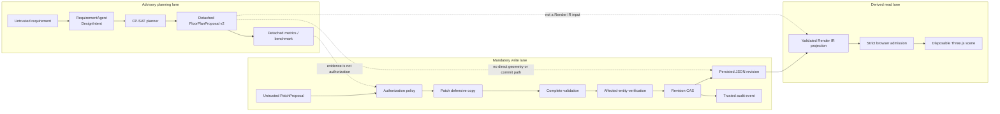

# Architecture Overview

## Core invariant

Only a persisted JSON revision is the authoritative World Model.

`DesignIntent`, solver coordinates, `FloorPlanProposal`, `PatchProposal`, evaluation results,
benchmark reports, Shapely objects, SVG, Render IR, and Three.js scene state each have a narrower
role. None can declare itself authoritative or commit a revision.

This document summarizes the implemented architecture; it does not propose a replacement.

## Three separated lanes



The dotted edges are prohibited boundaries, not data flows.

## Trust categories

| Category | Examples | Permitted role |
| --- | --- | --- |
| Untrusted input | HTTP JSON, requirement text, LLM output, datasets, imported reports | Enter a strict boundary |
| Typed advisory | `DesignIntent`, `FloorPlanProposal`, `PatchProposal` | Candidate interpretation or change |
| Trusted control | authorization, validators, affected-entity verification, CAS | Decide whether a write may proceed |
| Authoritative state | persisted immutable JSON revision | Define World Model truth |
| Derived read-only | SVG, Render IR, Three.js scene, metrics, benchmark report | Display or compare recreatable output |

## Planning lane

The requirement boundary is an injected `RequirementParser` used by `RequirementAgent`. The
default runtime composition uses `RuleBasedRequirementParser`. The bundled showcase instead
replays typed responses through:

```text
MockLLMProvider
  -> LLMRequirementParser
  -> RequirementAgent
  -> exact immutable DesignIntent
```

This recorded path exercises the same typed adapter boundary without network access. Its metadata
is explicitly `recorded-mock-llm-requirement-parser`, never OpenAI.

The optional real provider is `OpenAIResponsesProvider` under `infrastructure/llm`. It supports
only `DesignIntent` output and is created only by explicit composition. It receives requirement
text, not a World Model, revision, repository, geometry, Patch service, or authorization gateway.

`ArchitecturePlannerAgent` adapts `ConstraintFloorPlanPlanner`. The planner creates a bounded
integer-grid `PlanningProblem`, invokes OR-Tools CP-SAT with one worker and fixed seed, and accepts
only `OPTIMAL`. `FEASIBLE`, `UNKNOWN`, `MODEL_INVALID`, and `INFEASIBLE` fail closed.

Its output is an exact immutable `FloorPlanProposal 2.0.0` containing advisory room placement,
boundary, orientation, and spatial-constraint bindings. The solver package imports no World Model
repository, application service, authorization policy, renderer, FastAPI, LLM SDK, or Shapely.

## Showcase artifact lane

`src/ai_parametric_architect/showcase.py` defines the versioned detached preview contract.
`src/ai_parametric_architect/showcase_generation.py` is trusted offline composition for three
curated scenarios. It injects typed requirement and planning agents, computes proposal digests,
and obtains metrics from `PlanningMetricsEvaluator`.

Known planning errors are reduced to allowlisted `stage`, `code`, and `path`. Exception text,
details, provider payloads, and secrets are not serialized. An intent-stage rejection contains
no typed intent; a plan-stage rejection retains the already parsed `DesignIntent` but contains
no proposal, digest, or evidence.

The generator does not construct `WorldModelRenderIRProjector`, an editing service, a revision
repository, or a commit request. Architecture and security tests enforce these absences.

The browser loads the preview from the same origin, caps it at 1 MiB, validates exact fields and
bounded counts, checks finite values and references, and deeply freezes the admitted object.
Proposal rendering is local SVG/React presentation; it is not the Three.js World Model path.

## Authoritative write lane

Agent-originated changes require an `AgentPatchCommitRequest` containing a `DesignIntent` and
`PatchProposal`. `AgentAuthorizationGateway` verifies the requested capability, model and base
revision, allowed operations and paths, allowed entity types, intent/planning alignment, and
declared affected entities.

Authorization is necessary but not sufficient. The application then:

1. reads the immutable expected revision;
2. applies supported RFC 6902 operations to a defensive JSON copy;
3. performs strict JSON, schema, complexity, semantic/reference, and Shapely validation;
4. verifies actual versus declared affected entities;
5. commits only if compare-and-swap still matches the repository head; and
6. records trusted audit identity on a separate channel.

Proposal provenance and rationale remain untrusted strings. They cannot create human or system
identity. Evaluation and benchmark types are not accepted commit requests.

The current showcase never enters this lane.

## Visualization lane

The backend Render IR endpoint accepts a World Model document, then applies the same strict JSON,
schema, complexity, semantic/reference, and geometry gates before projection. Render IR 1.0.0
retains source model ID, revision, schema version, and root building ID in a new standard-JSON
tree.

The browser accepts only same-origin Render IR, including after redirects, with credentials set
to `same-origin`. Admission enforces:

- a 2 MiB streamed response limit;
- exact fields and supported literals;
- finite coordinates, bounds, rings, and cross-references;
- at most 128 floors, 10,000 objects, and 100,000 geometry points; and
- deep freezing before scene construction.

Render IR cannot supply URLs, textures, materials, colors, shaders, or executable content.
Three.js materials are hard-coded. React renders names as text. Device pixel ratio is capped at
2, and scene teardown disposes controls, geometry, materials, textures, renderer resources, event
listeners, observation, animation, and the WebGL context.

Render IR is not a revision snapshot or a second World Model. The frontend has no raw model,
Patch, repository, authorization, or commit client.

## Benchmark lane

The top-level `ai_parametric_architect.benchmark` package is authority-neutral. Its core receives
intent agents, planning agents, and a monotonic clock through narrow ports. It does not read a
World Model or import write services.

The requirements dataset and reference annotations are separate strict artifacts. A two-track
runner prevents label leakage:

- **end-to-end** sends only requirement text through parser and planner;
- **oracle-intent** sends the external reference intent directly to the same planner.

Reports retain allowlisted identities, scores, coverage counts, proposal SHA-256 digests,
nanosecond timing summaries, and redacted known failures. They exclude raw requirements,
reference intents, proposal geometry, provider messages, prompts, exception details, and
credential fields.

The CLI is the only benchmark component that writes, and it writes only the operator-selected
report path. It cannot overwrite either input artifact. Reports still require filesystem access
control and retention policy; an unkeyed digest is not a signature.

## Capability discovery

FastAPI exposes `GET /v1/capabilities` with exactly three booleans:

- `openai_requirement_parser_available`;
- `benchmark_live_mode_available`; and
- `live_planning_preview_available`.

All default to false and are supplied only through explicit `PublicCapabilities` composition.
Environment variables and secret presence do not modify them.

This release's Design Studio exposes no OpenAI live control even if custom composition declares
one or more flags, because it has no reviewed live planning-preview endpoint. Capability values
are diagnostic/future discovery metadata, not a UI or authority switch. Advertising and exposing
a future mode must follow implementation, strict admission tests, and security review.

## Module responsibilities

| Module | Owns | Must not own |
| --- | --- | --- |
| `domain` | neutral immutable model, intent, revision, Patch, proposal, and error values | FastAPI, OpenAI, Three.js, or persistence adapters |
| `planning` | rule and CP-SAT detached planning | repository, renderer, commit, or provider access |
| `llm` | provider-neutral typed prompts and proposal adapters | vendor SDK, repository, mutation, or authorization |
| `infrastructure/llm` | opt-in OpenAI intent adapter | FloorPlan/Patch network generation or write authority |
| `evaluation` | detached metrics and scenario evaluation | repository or commit |
| `benchmark` | strict data/report contracts and two-track runner | World Model, validation, authorization, renderer, or revision |
| `renderer` | deterministic SVG and Render IR projection after validation | inventing or persisting geometry |
| `application` | orchestration, validation, affected-entity checks, CAS | trusting proposal claims |
| `repositories` | immutable revisions, head/history, audit events | bypassing validation or CAS |
| `frontend` | separate Proposal Preview, BenchmarkReport, and Render IR admission plus advisory/read-only visualization | mixing proposal and Render IR authority, raw model editing, Patch, authorization, or commit |

## Current limitations

- The in-memory repository is process-local and not durable or multi-tenant.
- The Studio replays three curated planning recordings; it is not an arbitrary-input live agent.
- The real OpenAI adapter supports requirement-to-intent only and is not part of default routes.
- Proposal placement has no implemented realization path into committed World Model geometry.
- Render IR 1.0.0 omits stairs and represents openings as panels without wall CSG.
- Planning metrics are regression/ranking signals, not building-code or safety proofs.
- Native solver and browser GPU workloads still require deployment-level isolation and quotas.
- Public deployment still needs authentication, tenant isolation, durable audit, rate limits,
  egress policy, secret management, monitoring, backups, and incident response.

For operational use, see [SHOWCASE.md](SHOWCASE.md). For score interpretation, see
[BENCHMARK_METHODOLOGY.md](BENCHMARK_METHODOLOGY.md).
